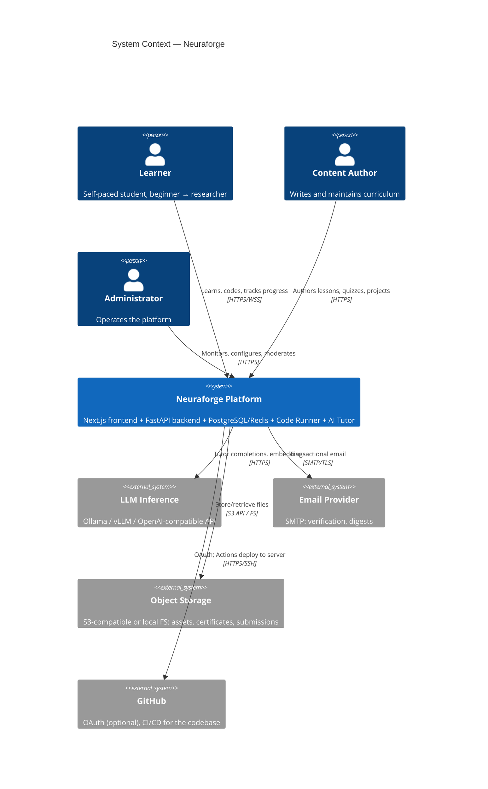
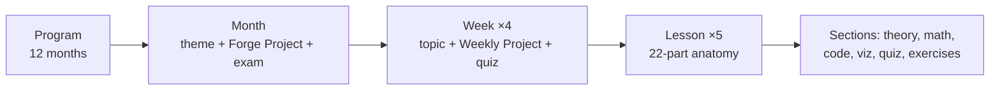
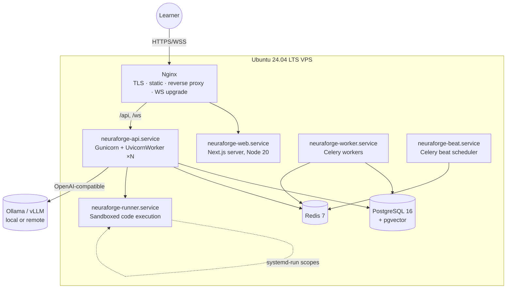

# Neuraforge — Software Requirements Specification (SRS)

| | |
|---|---|
| **Document** | Phase 1 — Software Requirements Specification |
| **Product** | Neuraforge: Building Large Language Models From Scratch — A 12-Month Interactive AI Engineering Program |
| **Version** | 1.0 (Draft for review) |
| **Date** | 2026-07-16 |
| **Standard** | Adapted from IEEE 830-1998 / ISO/IEC/IEEE 29148 |
| **Audience** | Product owner, architects (Phase 2), developers (Phases 5–11), DevOps (Phase 12), curriculum authors |

---

## Table of Contents

1. [Introduction](#1-introduction)
2. [Overall Description](#2-overall-description)
3. [Functional Requirements](#3-functional-requirements)
4. [Curriculum & Content Requirements](#4-curriculum--content-requirements)
5. [Non-Functional Requirements](#5-non-functional-requirements)
6. [External Interface Requirements](#6-external-interface-requirements)
7. [User Stories & Acceptance Criteria](#7-user-stories--acceptance-criteria)
8. [Test Plan](#8-test-plan)
9. [Security Considerations](#9-security-considerations)
10. [Deployment & Environment Requirements (Docker-Free)](#10-deployment--environment-requirements-docker-free)
11. [Documentation & Repository Structure](#11-documentation--repository-structure)
12. [Risks](#12-risks)
13. [Future Enhancements](#13-future-enhancements)
14. [Phase Gate & Approval](#14-phase-gate--approval)

---

## 1. Introduction

### 1.1 Purpose

This SRS defines the complete functional, non-functional, curricular, and operational
requirements for **Neuraforge**, an open-source interactive web platform that teaches a learner
to build modern Large Language Models (LLMs) from absolute beginner to advanced researcher over
a structured 12-month program. It is the contract against which all subsequent phases
(architecture, database, UI/UX, implementation, deployment) are designed and verified.

### 1.2 Scope

Neuraforge is a **complete online course platform**, not a roadmap. It delivers:

- A 12-month curriculum: 12 months × 4 weeks × 5 lessons = **240 lessons**, each with theory, mathematics, interactive visualizations, runnable code, exercises, quizzes, and projects.
- A full learning application: dashboard, progress tracking, assessments, gamification, notes, search, study tools, and an integrated AI tutor ("Ember").
- A production deployment story that is itself part of the curriculum: **Python-native, Docker-free** deployment on Linux (venv/uv, Gunicorn+Uvicorn, Nginx, systemd, GitHub Actions).

**Out of scope for v1.0:** mobile native apps, payment/subscription processing, multi-tenant
white-labeling, live cohort video sessions, GPU-cluster job scheduling for learners (see §13).

### 1.3 Definitions & Abbreviations

| Term | Definition |
|---|---|
| **Lesson** | Smallest schedulable learning unit (~60–120 min) with the 22-part anatomy of §4.3 |
| **Forge Project** | Monthly capstone project (§4.5) |
| **Daily Spark** | Short daily challenge (≤15 min) |
| **Ember** | The integrated AI tutor (§3.10) |
| **XP** | Experience points earned from learning activities |
| **SRS/JWT/RAG/PEFT/RLHF/DPO/MCP** | Standard industry meanings; MCP = Model Context Protocol |
| **Runner** | Sandboxed code-execution service for learner code |
| **CMS** | The internal content authoring/management subsystem |

### 1.4 References

- Course design benchmarks: Coursera, DeepLearning.AI, Udacity, MIT OCW, Fast.ai
- IEEE 830-1998, ISO/IEC/IEEE 29148:2018 (requirements engineering)
- WCAG 2.1 AA; OWASP ASVS 4.0 & OWASP Top 10 (2021)
- [Branding Guide](../branding/BRANDING.md)

### 1.5 Requirement conventions

Requirements are identified as `FR-<module>-<n>` (functional) and `NFR-<area>-<n>`
(non-functional) and prioritized by **MoSCoW**: **M**ust, **S**hould, **C**ould, **W**on't (v1).
"Shall" denotes a binding requirement.

---

## 2. Overall Description

### 2.1 Product perspective & context

Neuraforge is a self-contained web application. It integrates outward only with: an LLM
inference endpoint for Ember (local via Ollama/vLLM or any OpenAI-compatible API), an SMTP
provider (email verification), object storage (S3-compatible or local filesystem), and GitHub
(OAuth login — optional; CI/CD for the project itself).



### 2.2 User classes & personas

| Class | Persona | Needs | Priority |
|---|---|---|---|
| **Learner (beginner)** | *Amina, 22* — CS-adjacent degree, basic Python, no ML | Gentle on-ramp, intuition-first lessons, instant feedback, motivation systems | Primary |
| **Learner (practitioner)** | *Dev, 31* — backend engineer moving into AI | Skip-ahead placement, rigorous math derivations, production content, interview prep | Primary |
| **Learner (researcher-track)** | *Chen, 27* — MSc student | Paper reading lists, research questions, from-scratch implementations | Secondary |
| **Content Author** | Curriculum maintainer | Structured authoring (MDX), versioning, preview, analytics on question quality | Secondary |
| **Administrator** | Platform operator | User management, system health, content publishing workflow, moderation | Secondary |
| **Guest** | Anonymous visitor | Browse syllabus + sample lessons before registering | Tertiary |

### 2.3 Operating environment

- **Client:** evergreen browsers (last 2 versions of Chrome/Firefox/Safari/Edge), desktop-first, responsive to 360 px; dark and light themes.
- **Server:** Ubuntu Server 22.04/24.04 LTS on a single VPS (v1 baseline: 4 vCPU / 8 GB RAM) scaling to multi-node (§5, §10). **No container runtime.** Python 3.12+, Node.js 20 LTS (build-time only), PostgreSQL 16, Redis 7, Nginx 1.24+.
- **Development:** Windows/macOS/Linux with `uv`-managed virtualenvs; no Docker anywhere in the toolchain.

### 2.4 Design & implementation constraints

| ID | Constraint |
|---|---|
| C-1 | **Docker and all container tooling are prohibited** in development, CI, and production. Environments are reproduced via `uv` lockfiles, `pyproject.toml`, `.env` files, systemd units, and idempotent deployment scripts. |
| C-2 | Backend in Python 3.12+/FastAPI; frontend in Next.js/TypeScript (stack fixed as listed in README). |
| C-3 | Learner code execution must be sandboxed **without containers** (see FR-RUN-4 and §9) — process isolation via dedicated unprivileged user, `systemd-run` transient scopes with cgroup limits, seccomp/AppArmor profiles, resource/time quotas. |
| C-4 | All curriculum content stored as versioned structured content (MDX + JSON metadata) in the repository — content is code. |
| C-5 | Platform must run fully offline/self-hosted (Ember degrades gracefully to a local model via Ollama/llama.cpp). |
| C-6 | Open-source licensing: MIT (code), CC BY-SA 4.0 (curriculum) — pending owner approval. |
| C-7 | Math rendered client-side with KaTeX (MathJax fallback for edge cases); diagrams with Mermaid. |

### 2.5 Assumptions & dependencies

- A-1: Learners have a machine capable of running a browser; GPU **not** required for months 1–6 (in-browser + server CPU execution suffice); months 7–12 offer cloud/Colab fallback instructions.
- A-2: An LLM endpoint is available for Ember (self-hosted Ollama acceptable; quality degrades gracefully).
- A-3: Single product owner approves each phase before the next begins.
- A-4: English is the v1 content language (i18n architecture-ready, §13).

---

## 3. Functional Requirements

Modules: **AUTH** (accounts) · **DASH** (dashboard) · **LEARN** (learning engine) · **LESSON**
(lesson player) · **RUN** (code runner) · **VIZ** (interactive visualizations) · **ASSESS**
(assessments) · **GAME** (gamification) · **TOOLS** (notes, search, study tools) · **TUTOR**
(Ember) · **CMS** (authoring) · **ADMIN** (administration) · **CERT** (certificates).

### 3.1 AUTH — Accounts & access

| ID | Requirement | Priority |
|---|---|---|
| FR-AUTH-1 | The system shall support registration with email + password, with email verification. | M |
| FR-AUTH-2 | The system shall support OAuth sign-in with GitHub and Google. | S |
| FR-AUTH-3 | The system shall issue short-lived JWT access tokens (≤15 min) with rotating refresh tokens (httpOnly, Secure, SameSite cookies). | M |
| FR-AUTH-4 | The system shall support password reset via time-limited single-use email tokens. | M |
| FR-AUTH-5 | The system shall support TOTP two-factor authentication. | S |
| FR-AUTH-6 | The system shall enforce role-based access control: `guest`, `learner`, `author`, `admin`. | M |
| FR-AUTH-7 | The system shall let users view active sessions and revoke them, export their data (JSON), and delete their account (soft-delete, 30-day purge). | S |
| FR-AUTH-8 | Guests shall be able to browse the syllabus and 3 designated sample lessons without an account. | S |

### 3.2 DASH — Dashboard & progress tracking

| ID | Requirement | Priority |
|---|---|---|
| FR-DASH-1 | The dashboard shall show: current position in the curriculum ("Continue lesson" CTA), overall % complete, month/week progress rings, Forge Streak, XP, next Daily Spark, upcoming revision items, and recent achievements. | M |
| FR-DASH-2 | The system shall track per-lesson state: `not_started / in_progress / completed`, with per-section granularity (theory read, quiz passed, exercises passed, assignment submitted). | M |
| FR-DASH-3 | A lesson shall be marked complete only when its completion rule is met (default: quiz ≥ 70% AND all required exercises pass; rule configurable per lesson). | M |
| FR-DASH-4 | Learning statistics shall include: time-on-task per day/week/topic (heatmap), quiz accuracy trends, exercise attempts, strongest/weakest topics, and projected completion date at current pace. | M |
| FR-DASH-5 | The system shall render a syllabus map (12 months → 48 weeks → 240 lessons) with prerequisite locking (configurable: strict lock vs. advisory warning; default advisory). | M |
| FR-DASH-6 | Learners shall be able to set a target pace (lessons/week) and receive schedule drift indicators. | S |

### 3.3 LEARN — Learning engine (sequencing & spaced repetition)

| ID | Requirement | Priority |
|---|---|---|
| FR-LEARN-1 | The engine shall enforce/advise prerequisites declared per lesson (DAG, not just linear order). | M |
| FR-LEARN-2 | The engine shall schedule spaced-repetition reviews of flash cards and missed quiz questions using FSRS (free spaced repetition scheduler) or SM-2. | M |
| FR-LEARN-3 | The engine shall generate a personalized **Revision Planner**: a daily queue combining due flash cards, weak-topic quiz items, and stale skills. | M |
| FR-LEARN-4 | An optional placement diagnostic shall let practitioners test out of Month 1–2 lessons (lessons marked completed-by-exam, distinguishable in analytics). | S |
| FR-LEARN-5 | The engine shall issue Daily Sparks (1 per day, from a pool matched to the learner's current month) and Weekly Projects reminders. | M |

### 3.4 LESSON — Lesson player

| ID | Requirement | Priority |
|---|---|---|
| FR-LESSON-1 | The player shall render the full 22-part lesson anatomy (§4.3) from MDX: prose, KaTeX math, Mermaid diagrams, images, video embeds, callouts, footnotes, and citations. | M |
| FR-LESSON-2 | The player shall provide a persistent outline/sidebar with per-section completion ticks and estimated reading time. | M |
| FR-LESSON-3 | Notebook-style lessons shall interleave editable, runnable code cells with prose (Jupyter-like UX backed by the Runner). | M |
| FR-LESSON-4 | Every code sample shall offer: copy, edit-in-place (Monaco), run, reset-to-original, and "Explain this code" (Ember). | M |
| FR-LESSON-5 | The player shall support keyboard navigation, bookmarking any section anchor, and margin notes (§3.9). | M |
| FR-LESSON-6 | Lessons shall be downloadable as PDF for offline study (server-rendered, print stylesheet). | C |
| FR-LESSON-7 | The player shall remember scroll/section position per learner and resume there. | S |

### 3.5 RUN — Code execution

| ID | Requirement | Priority |
|---|---|---|
| FR-RUN-1 | Learners shall edit code in Monaco with Python syntax highlighting, autocomplete (Pyright-lite), and error squiggles. | M |
| FR-RUN-2 | The Runner shall execute Python (with numpy, torch-CPU, matplotlib pre-installed) and return stdout/stderr, rich outputs (matplotlib PNGs, dataframes), and per-test results. | M |
| FR-RUN-3 | Lightweight exercises shall run **in-browser via Pyodide (WebAssembly)** where dependencies allow, falling back to the server Runner otherwise; the choice is per-exercise metadata. | M |
| FR-RUN-4 | Server-side execution shall be sandboxed **without containers**: dedicated unprivileged OS user, `systemd-run` transient units with CPU/memory/pids/time limits, no network by default, read-only curriculum FS, ephemeral tmpfs workdir, seccomp filter. | M |
| FR-RUN-5 | Exercise grading shall run hidden test suites (pytest) against learner code and report per-test pass/fail with sanitized output. | M |
| FR-RUN-6 | Execution quotas per learner (e.g., 300 runs/day, 30 s CPU, 512 MB) shall be enforced and configurable. | M |
| FR-RUN-7 | Long-running training exercises (months 4+) shall queue via Celery with live log streaming over WebSocket. | S |

### 3.6 VIZ — Interactive visualizations

| ID | Requirement | Priority |
|---|---|---|
| FR-VIZ-1 | The platform shall ship a reusable interactive-widget library embeddable in MDX: sliders/parameter controls bound to live plots, step-through animations (play/pause/step/scrub), and state reset. | M |
| FR-VIZ-2 | The following named visualizers shall exist: **Tensor Visualizer** (shape/values/broadcasting), **Model Visualizer** (layer graph), **Attention Visualizer** (head × token heatmaps), **Embedding Visualizer** (2D/3D projection, Three.js), **Loss Curve Explorer**, **Learning-Rate Simulator**, **Gradient-Descent Playground** (2D/3D loss surfaces), **Matrix-Multiply Stepper**, **Backprop Graph Stepper**, **Tokenizer Playground**, **Sampling Playground** (temperature/top-k/top-p). | M |
| FR-VIZ-3 | Every visualizer shall respect `prefers-reduced-motion`, be keyboard-operable, and provide a textual description of its current state. | M |
| FR-VIZ-4 | Visualizers shall accept live tensors from the learner's own Runner output where marked (e.g., visualize *your* attention weights). | S |

### 3.7 ASSESS — Assessments

| ID | Requirement | Priority |
|---|---|---|
| FR-ASSESS-1 | Question types: multiple choice (single/multi), numeric with tolerance, expression match (SymPy-equivalence), code-output prediction, fill-in-blank, ordering, matching, and free-text (Ember-assisted rubric grading, author-reviewable). | M |
| FR-ASSESS-2 | Each lesson shall include a mini-quiz (5–10 questions) with instant feedback and per-option explanations. | M |
| FR-ASSESS-3 | Weekly quizzes, monthly exams, and the final Forgemaster exam shall be assembled from the question bank by blueprint (topic × difficulty × type distribution) with randomized selection and option shuffling. | M |
| FR-ASSESS-4 | The question bank shall hold, at launch: ≥1000 practice questions, ≥500 coding challenges, ≥300 interview questions, ≥200 research/discussion questions, each tagged with topic, month/week, difficulty (1–5), Bloom level, and type. | M |
| FR-ASSESS-5 | Coding challenges shall support multiple hidden test cases, time/memory limits, hints (progressive, XP-costed), reference solutions (unlocked after pass or 3 attempts), and "Explain My Mistake" (Ember diff-analysis of learner code vs. failing tests). | M |
| FR-ASSESS-6 | Assignments and Forge Projects shall accept file/repo submissions with autograded components + self-assessment checklist + optional Ember review. | M |
| FR-ASSESS-7 | All attempts shall be recorded (answer, duration, hints used) to drive analytics and spaced repetition. | M |
| FR-ASSESS-8 | Interview-prep mode shall serve interview questions by company-style filters (research lab / product / infra) with model answers. | C |

### 3.8 GAME — Gamification

| ID | Requirement | Priority |
|---|---|---|
| FR-GAME-1 | XP shall be awarded for: lesson completion, quiz performance, exercise passes (first-try bonus), Daily Sparks, Weekly Projects, Forge Projects, and review sessions; XP rules are server-authoritative. | M |
| FR-GAME-2 | Forge Streak: consecutive days with ≥1 meaningful activity; streak freezes (2/month) earnable; streak state visible on dashboard. | M |
| FR-GAME-3 | Achievements (≥60 at launch) across tiers Iron→Mythril, with hidden achievements for exploration; each has icon, criteria, and grant timestamp. | M |
| FR-GAME-4 | Leaderboard: weekly XP, opt-in, with anonymized handle option; never ranks assessment scores. | S |
| FR-GAME-5 | Learner rank (Apprentice → Forgemaster) shall derive from curriculum quarter completion, not XP. | S |

### 3.9 TOOLS — Notes, bookmarks, search, study tools

| ID | Requirement | Priority |
|---|---|---|
| FR-TOOLS-1 | Markdown notes: global notebook + per-lesson margin notes anchored to section IDs; exportable (MD/JSON). | M |
| FR-TOOLS-2 | Bookmarks on lessons, sections, questions, and visualizer states, organized in folders. | M |
| FR-TOOLS-3 | Global search (⌘K) across lessons, glossary, questions, notes, and code samples with typo tolerance and filters; backed by PostgreSQL FTS + pgvector semantic search. | M |
| FR-TOOLS-4 | Flash cards: system decks per lesson + learner-created cards (front/back MD with math/code); reviewed via the LEARN scheduler. | M |
| FR-TOOLS-5 | Study timer: Pomodoro with per-topic tagging feeding time-on-task stats; optional focus mode (hides chrome). | S |
| FR-TOOLS-6 | Glossary: every technical term first-used in a lesson links to a glossary entry with definition, notation, and related lessons. | S |

### 3.10 TUTOR — Ember (AI tutor)

| ID | Requirement | Priority |
|---|---|---|
| FR-TUTOR-1 | Ember shall be reachable from any page via chat panel, with streaming responses (WebSocket/SSE) and full math/code rendering. | M |
| FR-TUTOR-2 | Ember shall be context-aware: current lesson section, learner's recent errors, quiz history, and code in the active editor are injected (with learner consent toggle). | M |
| FR-TUTOR-3 | Capabilities: explain concepts at 3 depth levels ("intuition / math / implementation"), generate hints (never full solutions for active assessments), review assignment code, debug learner code, generate practice quizzes, summarize lessons, create flash cards from a lesson, propose revision plans. | M |
| FR-TUTOR-4 | Ember shall run against any OpenAI-compatible endpoint (config: base URL + model + key), including local Ollama/vLLM; provider failure degrades to non-AI hints. | M |
| FR-TUTOR-5 | Guardrails: Ember shall refuse to reveal hidden test cases or exam answers; assessment-mode prompts are restricted server-side (not client-enforced). | M |
| FR-TUTOR-6 | Retrieval: Ember answers are grounded in curriculum content via RAG (pgvector embeddings of lessons/glossary) with inline citations to lesson sections. | M |
| FR-TUTOR-7 | Conversation history persists per learner, searchable; learners can delete conversations. | S |
| FR-TUTOR-8 | Token/cost budgets per learner per day shall be enforceable by admins. | M |

### 3.11 CMS — Content authoring

| ID | Requirement | Priority |
|---|---|---|
| FR-CMS-1 | Content lives in-repo as MDX + JSON/YAML frontmatter (lesson metadata, prerequisites, duration, difficulty, completion rules); a build step validates schema and compiles to the content database. | M |
| FR-CMS-2 | Content validation shall fail CI on: broken internal links, missing prerequisite IDs, schema violations, non-compiling code samples, quiz answers-key errors, and KaTeX/Mermaid syntax errors. | M |
| FR-CMS-3 | Authors shall have a live-preview mode rendering exactly as learners see it. | M |
| FR-CMS-4 | Content shall be versioned; published lessons carry a version, and learner progress survives content updates (anchored to stable section IDs). | M |
| FR-CMS-5 | Question authoring shall support bulk import (structured YAML/CSV) and item analytics (difficulty, discrimination index) to flag bad questions. | S |

### 3.12 ADMIN — Administration & operations UI

| ID | Requirement | Priority |
|---|---|---|
| FR-ADMIN-1 | Admin console: user management (search, roles, suspend), content publish/rollback, feature flags, Runner quota config, Ember provider/budget config. | M |
| FR-ADMIN-2 | Operational dashboards: signups, DAU/WAU, lesson funnel completion, Runner queue depth/failures, Ember latency/cost, error rates. | S |
| FR-ADMIN-3 | Announcement banners and changelog posts to learners. | C |

### 3.13 CERT — Certificates

| ID | Requirement | Priority |
|---|---|---|
| FR-CERT-1 | Monthly certificates on month completion (all lessons + Forge Project graded pass) and the **Forgemaster Certificate** on program completion. | M |
| FR-CERT-2 | Certificates are rendered PDFs (branded template) with a unique ID and public verification URL (`/verify/<id>`). | M |
| FR-CERT-3 | Shareable social card (OpenGraph image) per certificate. | C |

---

## 4. Curriculum & Content Requirements

### 4.1 Program structure

**12 months → 4 weeks/month → 5 lessons/week = 240 lessons**, plus per week: 1 Weekly Project;
per month: 1 Forge Project + 1 monthly exam; daily: 1 Daily Spark.



### 4.2 Twelve-month syllabus (themes and Forge Projects)

| Month | Theme | Core topics (summary) | Forge Project |
|---|---|---|---|
| 1 | **Python & Math Foundations** | Python for AI, software engineering practice, venv/uv, testing, logging; vectors, matrices, matrix multiplication | Matrix Calculator (CLI + tested library, published to TestPyPI) |
| 2 | **Linear Algebra & Neural Nets I** | Eigenvalues/vectors, norms, projections; perceptron, activation functions, forward pass in pure Python/NumPy | Neural Network From Scratch |
| 3 | **Calculus, Optimization & Backprop** | Derivatives, partials, chain rule, Jacobians, gradient descent variants; autodiff | Backpropagation Engine (micro-autograd) |
| 4 | **Deep Learning with PyTorch** | Tensors, modules, DataLoaders, training loops, regularization, CNN basics, GPU/CUDA basics | Image Classifier |
| 5 | **Probability, Statistics & NLP I** | Probability, entropy, cross-entropy, KL divergence, softmax, loss functions; text preprocessing, classical NLP | Text Classifier |
| 6 | **Embeddings & Language Modeling I** | Tokenization (BPE/WordPiece/SentencePiece), embeddings, Word2Vec/GloVe, n-gram & RNN LMs, information theory in LM | Word2Vec (from scratch + evaluation suite) |
| 7 | **Transformers From Scratch** | Attention, self/multi-head attention, positional encoding, LayerNorm, residuals, encoder/decoder blocks | Transformer From Scratch (translation task) |
| 8 | **GPT & Training at Scale** | Decoder-only models, training pipelines, mixed precision, distributed training (DDP/FSDP concepts), inference: beam/sampling/temperature/top-k/top-p | GPT From Scratch (train a small GPT on real corpus) |
| 9 | **Fine-Tuning & Alignment** | HuggingFace ecosystem, fine-tuning, PEFT/LoRA/QLoRA, quantization, RLHF, DPO, knowledge distillation, evaluation | Fine-Tune Llama (instruction-tune with QLoRA + eval report) |
| 10 | **Retrieval & Knowledge Systems** | Vector databases, embeddings in practice, chunking, RAG architectures, LlamaIndex/LangChain, evaluation of RAG | RAG System over the Neuraforge curriculum itself |
| 11 | **Agents & Tooling** | AI agents, function calling, memory systems, MCP, multi-step planning, safety of agentic systems | AI Agent (tool-using research assistant with MCP) |
| 12 | **Production AI Engineering (Docker-free)** | Linux admin, venv/uv in prod, FastAPI serving, vLLM/llama.cpp/Ollama, Gunicorn+Uvicorn, Nginx, systemd, SSL, GitHub Actions CI/CD, monitoring/logging/backups, security hardening, performance optimization, AI safety & model evaluation in prod | **Train and deploy a production LM on a native Python stack** |

*(The full 240-lesson breakdown — week/lesson titles, objectives, prerequisites DAG — is a Phase 8 deliverable; this table is the binding scope.)*

### 4.3 Lesson anatomy (22 required parts)

Every lesson shall contain, in order: **1** Learning Objectives · **2** Prerequisites (linked) ·
**3** Estimated Duration · **4** Difficulty Rating (1–5) · **5** Intuition-first Theory ·
**6** Historical Background · **7** Real-World Applications · **8** Interactive Visualization(s) ·
**9** Worked Examples · **10** Animations (step-controllable) · **11** Mathematical Derivation
(where applicable) · **12** Code Walkthrough (pure Python → NumPy → PyTorch progression where
applicable) · **13** Optimization & Production Notes · **14** Exercises (graded) · **15** Practice
Questions · **16** Mini Quiz · **17** Assignment · **18** Project tie-in · **19** Summary ·
**20** Further Reading + Research Papers · **21** Recommended Videos + References ·
**22** Flash-card deck.

**Pedagogical sequence (binding):** intuition → mathematics (derived, not stated) → pure-Python
implementation → PyTorch implementation → optimization → production context. Every equation
must carry: plain-language explanation, worked numeric example, visual interpretation, and a
Python snippet. Every lesson must include at least one diagram (Mermaid preferred).

### 4.4 Content volume requirements (launch)

| Content type | Minimum count |
|---|---|
| Lessons | 240 |
| Practice questions | 1,000 |
| Coding challenges | 500 |
| Interview questions | 300 |
| Research questions | 200 |
| Daily Spark pool | 400 |
| Weekly Projects | 48 |
| Forge Projects | 12 |
| System flash cards | 2,000 |
| Glossary entries | 500 |
| Named visualizers | 11 (FR-VIZ-2) |

### 4.5 Project requirements

Each Weekly Project and Forge Project shall define: brief, starter repo/scaffold, functional
requirements, autograded checks, rubric, stretch goals, and a reference solution (unlocked post-
submission). Forge Project 12 must result in a learner-owned, publicly reachable deployed model
endpoint built with the Docker-free stack of §10 — the curriculum and the platform practice the
same deployment discipline.

---

## 5. Non-Functional Requirements

### 5.1 Performance

| ID | Requirement |
|---|---|
| NFR-PERF-1 | Lesson page LCP ≤ 2.5 s (p75, broadband); route transitions ≤ 300 ms perceived. |
| NFR-PERF-2 | API reads p95 ≤ 200 ms, writes p95 ≤ 400 ms (excluding Runner/Ember). |
| NFR-PERF-3 | In-browser (Pyodide) exercise start ≤ 3 s warm; server Runner round-trip ≤ 4 s p95 for standard exercises. |
| NFR-PERF-4 | Ember first-token ≤ 2.5 s p95 (provider-dependent; measured and surfaced). |
| NFR-PERF-5 | Baseline capacity: 500 concurrent active learners on the reference VPS; 5,000 with the scale-out topology (§10.6) without architectural change. |

### 5.2 Reliability & availability

- NFR-REL-1: 99.5% monthly availability target (v1, single-node with restore SLO); 99.9% in scale-out topology.
- NFR-REL-2: RPO ≤ 24 h (nightly `pg_dump` + WAL archiving target RPO ≤ 15 min in scale-out); RTO ≤ 4 h via scripted restore.
- NFR-REL-3: Progress writes are transactional; a failed write is retried client-side and never silently lost.
- NFR-REL-4: Runner and Ember failures degrade gracefully (queued retry / non-AI fallback) without blocking lesson reading.

### 5.3 Security (summary — detail in §9)

OWASP ASVS L2; Argon2id password hashing; JWT per FR-AUTH-3; TLS 1.2+; rate limiting; sandbox
per FR-RUN-4; full audit log of auth and admin events.

### 5.4 Usability & accessibility

WCAG 2.1 AA (axe-core CI gate); full keyboard operability including editor and visualizers;
dark/light themes; reduced-motion support; reading level: technical but jargon-linked (FR-TOOLS-6);
onboarding tour ≤ 3 min to first runnable code.

### 5.5 Maintainability & quality

- NFR-MAINT-1: Backend ≥ 85% line coverage on core modules; frontend critical-path E2E (Playwright) suite; content CI per FR-CMS-2.
- NFR-MAINT-2: Typed everywhere: mypy --strict (backend), TS strict (frontend), Pydantic at boundaries.
- NFR-MAINT-3: Lint/format: ruff + ruff-format (Python), ESLint + Prettier (TS); enforced in CI.
- NFR-MAINT-4: Conventional Commits; ADRs (architecture decision records) for every significant decision starting Phase 2.

### 5.6 Compatibility, privacy, compliance

- NFR-COMPAT-1: Last 2 evergreen browser versions; responsive 360 px–4K; no browser plugins required.
- NFR-PRIV-1: GDPR-aligned: consent for analytics, export & erasure (FR-AUTH-7), data minimization; learner code and Ember chats never used to train models without explicit opt-in.
- NFR-PRIV-2: Self-hosted analytics only (no third-party trackers).

---

## 6. External Interface Requirements

### 6.1 User interface

Defined fully in Phase 4. Binding principles: dark-first glassmorphism per the
[Branding Guide](../branding/BRANDING.md); app shell = left nav (syllabus), top bar (search ⌘K,
streak, XP, theme, Ember toggle), content canvas; lesson player = outline sidebar + 72ch prose
column + sticky action rail (notes, bookmark, Ember).

### 6.2 APIs

- **REST API** (`/api/v1/…`): OpenAPI 3.1 auto-generated by FastAPI; JSON; cursor pagination; RFC 9457 problem-details errors; versioned path.
- **WebSocket** (`/ws`): Runner log streaming, Ember token streaming, live XP/achievement events.
- **Webhooks/integrations:** GitHub OAuth callback; SMTP; S3-compatible storage API; OpenAI-compatible chat/embeddings API (configurable base URL).

### 6.3 Hardware & software interfaces

PostgreSQL 16 (with `pgvector`), Redis 7 (cache, rate-limit counters, Celery broker), systemd
(service supervision + Runner sandboxing), Nginx (TLS termination, static assets, reverse proxy,
WebSocket upgrade).

---

## 7. User Stories & Acceptance Criteria

Representative set (IDs stable; the full backlog lives in the project tracker from Phase 2 on).
Format: Gherkin-style acceptance criteria.

**US-01 — Register and start learning (Learner, M)**
*As a new learner, I want to sign up and reach my first lesson quickly so that I can start immediately.*
- Given a valid email/password, when I register, then I receive a verification email and can verify within 24 h.
- Given a verified account, when I first log in, then onboarding offers "start from Month 1" or "take placement diagnostic," and I reach Lesson 1.1.1 in ≤ 3 clicks.

**US-02 — Resume where I left off (Learner, M)**
- Given prior progress, when I open the dashboard, then a "Continue" card deep-links to my exact last section, and opening it restores scroll position (FR-LESSON-7).

**US-03 — Run and edit lesson code (Learner, M)**
- Given a code cell, when I press Run, then output appears inline in ≤ 4 s p95 (server) or ≤ 3 s warm (Pyodide), and stderr renders distinctly.
- When I edit the sample and re-run, then my edited version persists for my account and "Reset" restores the original.

**US-04 — Pass a coding exercise with hints (Learner, M)**
- Given a failing submission, when tests run, then I see per-test pass/fail and sanitized assertion output.
- When I request a hint, then hints unlock progressively (concept → approach → pseudocode), each deducting the stated XP; the full solution is not available until pass or 3 attempts.
- When I click "Explain My Mistake," then Ember explains the first failing test with reference to my code lines, without printing the hidden test bodies.

**US-05 — Take a mini quiz (Learner, M)**
- Given a 5–10 question quiz, when I answer, then instant feedback shows correctness and per-option explanations; scoring ≥ 70% marks the quiz section complete; missed questions enter my revision queue (FR-LEARN-2).

**US-06 — Use the Attention Visualizer (Learner, M)**
- Given the attention lesson, when I adjust head/layer/token sliders, then the heatmap updates ≤ 100 ms and the current state has a textual description; keyboard arrows step tokens; reduced-motion disables animated transitions.

**US-07 — Ask Ember for intuition (Learner, M)**
- Given any lesson section, when I ask "explain this," then Ember streams an answer grounded in the current section with citations, offering "go deeper: math" / "show me code" follow-ups.
- Given an active exam, when I ask for an answer, then Ember declines and offers concept review instead (server-enforced, FR-TUTOR-5).

**US-08 — Keep my Forge Streak (Learner, S)**
- Given a 13-day streak, when I complete any meaningful activity today, then the streak shows 14 with the day marked; given no activity by 23:59 (user's timezone) and an available freeze, the freeze auto-applies once and is consumed.

**US-09 — Submit a Forge Project (Learner, M)**
- Given Month 8's project, when I submit my repo/files, then autograded checks run and report; passing all required checks + submitting the self-assessment marks the project passed and unlocks the monthly certificate (with exam pass).

**US-10 — Plan my revision (Learner, M)**
- Given due flash cards and weak topics, when I open the Revision Planner, then today's queue lists items with reasons ("missed on quiz 3.2", "FSRS due"), and completing the queue awards review XP.

**US-11 — Author a lesson safely (Author, M)**
- Given an MDX lesson with a broken prerequisite ID, when CI runs, then the build fails naming file/line; given a valid lesson, preview renders identically to production.

**US-12 — Verify a certificate (Guest, M)**
- Given a certificate ID, when anyone opens `/verify/<id>`, then the page shows holder name, program/month, issue date, and validity — with no other personal data.

**US-13 — Operate the platform (Admin, M)**
- Given a misbehaving Ember provider, when I switch the provider config, then new chats use it within 60 s without restart; given Runner abuse, when I lower a user's quota, it applies to their next run.

**US-14 — Learn deployment by doing (Learner, M)**
- Given Month 12 lessons, when I follow the deployment track, then I provision Ubuntu, create a venv with uv, configure Gunicorn+Uvicorn, systemd, Nginx, TLS, and GitHub Actions — and my Forge Project endpoint answers HTTPS requests publicly; the platform's own deployment guide (§10) is the reference implementation.

---

## 8. Test Plan

### 8.1 Test levels & tooling

| Level | Scope | Tooling | Gate |
|---|---|---|---|
| Unit | Backend services, grading logic, XP rules, schedulers | pytest, pytest-asyncio, hypothesis (property tests for graders/FSRS) | CI, ≥85% core coverage |
| Unit (FE) | Components, hooks, MDX renderers | Vitest + React Testing Library | CI |
| Integration | API + DB + Redis + Celery; auth flows; Runner sandbox behavior | pytest + testcontainers-free fixtures (ephemeral Postgres/Redis via CI services or local installs) | CI |
| Contract | OpenAPI schema snapshot; FE client generated from schema | schemathesis | CI |
| E2E | US-01…US-14 critical journeys, both themes | Playwright | CI (merge gate) |
| Content | FR-CMS-2 validations; every code sample executes; quiz keys verified | custom content-CI (Python) | CI (content gate) |
| Accessibility | WCAG 2.1 AA on key templates | axe-core in Playwright | CI |
| Performance | NFR-PERF budgets | Lighthouse CI, k6 (API), locust (Runner) | pre-release |
| Security | §9 checklist, dependency audit, sandbox escape suite | ruff-security rules, pip-audit, custom sandbox tests, OWASP ZAP baseline | pre-release |

### 8.2 Special test obligations

- **Runner sandbox suite:** attempts network egress, fork bombs, oversized memory, filesystem escape, long sleeps — all must be contained and reported (maps to C-3/FR-RUN-4).
- **Ember guardrail suite:** prompt-injection attempts to extract hidden tests/exam keys must fail (FR-TUTOR-5).
- **Progress-integrity suite:** content version bump must not orphan learner progress (FR-CMS-4).

---

## 9. Security Considerations

| Area | Requirement |
|---|---|
| Authentication | Argon2id; login rate limiting + exponential backoff; TOTP 2FA (FR-AUTH-5); session revocation |
| Tokens | JWT RS256/EdDSA, ≤15 min access, rotating refresh in httpOnly Secure SameSite=Lax cookies; refresh reuse detection revokes the family |
| Transport | TLS 1.2+ only, HSTS, modern cipher suites (Mozilla intermediate) |
| Input | Pydantic validation everywhere; parameterized SQL via SQLAlchemy; MDX sanitization (no raw HTML from content authors without allowlist); SSRF-safe outbound fetches |
| Headers | CSP (nonce-based, no `unsafe-inline`), X-Content-Type-Options, Referrer-Policy, frame-ancestors 'none' (except embeddable visualizers if later allowed) |
| Code Runner | Defense-in-depth **without containers**: dedicated `nf-runner` user (no shell, no home write), `systemd-run --scope` with `MemoryMax`, `CPUQuota`, `TasksMax`, `RuntimeMaxSec`; `PrivateTmp`, `ProtectSystem=strict`, `ProtectHome`, `NoNewPrivileges`, `RestrictAddressFamilies` (no network), `SystemCallFilter` (seccomp allowlist); ephemeral tmpfs workdir wiped post-run; output size caps; quotas (FR-RUN-6) |
| AI tutor | Server-side prompt assembly (client never controls system prompt); secrets and hidden tests never enter Ember context; per-user budgets; injection-hardened retrieval (content is trusted-authored, learner text is quoted) |
| Secrets | `.env` files with 0600 perms, never committed; production secrets via environment or systemd credentials (`LoadCredential`) |
| Audit | Append-only audit log: auth events, role changes, content publishes, admin config changes, quota overrides |
| Dependencies | `uv` lockfile pinning; pip-audit + npm audit in CI; Renovate/Dependabot |
| Server | Ubuntu hardening in §10.7: UFW, SSH keys only, fail2ban, unattended-upgrades, least-privilege systemd sandboxing for app services too |
| Privacy | NFR-PRIV-1/2; PII minimization; no third-party trackers |

---

## 10. Deployment & Environment Requirements (Docker-Free)

> Binding constraint C-1: **no Docker, no containers, anywhere.** Reproducibility comes from
> lockfiles, scripts, and systemd. This entire section doubles as curriculum source material for
> Month 12.

### 10.1 Environment management

- Python 3.12+ via `uv python install`; one virtualenv per service (`uv venv`), dependencies locked with `uv.lock` (`uv sync --frozen` in prod).
- Node 20 LTS used **only at build time** (Next.js build on CI or a build host); production serves the built output via Node runtime under systemd (or `next start`), behind Nginx.
- Configuration via `.env` files validated by Pydantic Settings at startup; `.env.example` maintained; per-environment files (`.env.dev`, `.env.staging`, `.env.prod`).

### 10.2 Process topology (single-node baseline)



### 10.3 Service management

Every service is a systemd unit with: dedicated user, `Restart=on-failure`, resource limits,
hardening directives (§9), `EnvironmentFile=`, journald logging, and health checks
(`ExecStartPost` curl or systemd `Type=notify`). Zero-downtime API deploys via Gunicorn graceful
reload (`ExecReload=kill -HUP $MAINPID`) or blue-green ports switched in Nginx.

### 10.4 Deployment automation

- `scripts/provision.sh` — idempotent server bootstrap: users, packages (PostgreSQL, Redis, Nginx, certbot, uv), directories, firewall, fail2ban.
- `scripts/deploy.sh` — release deploy: fetch artifact, `uv sync --frozen`, `alembic upgrade head` (with lock), build/collect static, restart/reload units, smoke-check, automatic rollback on failed health check (previous release kept, `releases/` + `current` symlink pattern).
- **GitHub Actions:** on PR — lint, typecheck, tests, content CI; on tag — build artifacts (wheel + `next build` output), create release, SSH deploy to staging, manual approval → production. No registry, no images: artifacts are tarballs.

### 10.5 Data services

PostgreSQL 16 from PGDG apt repo, tuned baseline config, `pgvector` extension; nightly `pg_dump`
to object storage + WAL archiving (scale-out); Redis 7 with AOF everysec, `maxmemory` policy set;
restore runbooks tested quarterly (NFR-REL-2).

### 10.6 Scalability path (no architecture change)

1. **Vertical:** bigger VPS; raise Gunicorn workers (`2×CPU+1`) and PG connections (via PgBouncer).
2. **Split-node:** move PostgreSQL+Redis to a data node; app node(s) stateless.
3. **Horizontal:** N app nodes behind Nginx/HAProxy; Redis-backed shared state (sessions are JWT — stateless); Celery/Runner on dedicated worker nodes; sticky-free WebSockets via Redis pub/sub.
4. **AI split:** vLLM/Ollama on a GPU node reachable over private network.

### 10.7 Operations

- **SSL:** Let's Encrypt via certbot with auto-renew timer; A+ target on SSL Labs.
- **Monitoring:** node_exporter + Prometheus + Grafana (installed natively via apt/binaries), Alertmanager rules (disk, 5xx rate, queue depth, cert expiry); Sentry (self-hostable) for app errors.
- **Logging:** structured JSON logs (structlog) → journald → optional Loki; request IDs end-to-end.
- **Backups:** DB (10.5), object storage sync, `/etc` + unit files in the repo (declarative); restore drill scripted.
- **Hardening:** UFW default-deny (80/443/SSH), SSH key-only + non-standard port optional, fail2ban, unattended-upgrades, auditd baseline.

---

## 11. Documentation & Repository Structure

Planned monorepo layout (finalized in Phase 2; documentation tree binding now):

```
neuraforge/
├── README.md
├── LICENSE  ·  LICENSE-content
├── docs/
│   ├── branding/            # Phase 1 ✅  BRANDING.md · logo.svg · icon.svg
│   ├── phase-01-srs/        # Phase 1 ✅  SRS.md (this document)
│   ├── phase-02-architecture/   # C4 diagrams, ADRs, tech decisions
│   ├── phase-03-database/       # ERD, schema DDL, migration strategy
│   ├── phase-04-uiux/           # wireframes, design tokens, component specs
│   ├── phase-05..11-…/          # per-phase engineering docs
│   ├── phase-12-deployment/     # runbooks, provision/deploy guides, DR
│   └── adr/                     # architecture decision records
├── apps/
│   ├── web/                 # Next.js (TypeScript)
│   └── api/                 # FastAPI (Python, uv-managed)
├── services/
│   └── runner/              # sandboxed execution service
├── content/                 # curriculum: MDX lessons, questions, decks (content-as-code)
├── packages/                # shared TS packages (ui, api-client, viz-widgets)
├── scripts/                 # provision.sh, deploy.sh, backup.sh, restore.sh
└── .github/workflows/       # CI/CD (lint, test, content-CI, release, deploy)
```

---

## 12. Risks

| # | Risk | L×I | Mitigation |
|---|------|-----|-----------|
| R-1 | **Content volume** (240 lessons, 2000+ items) dwarfs platform effort | H×H | Content-as-code pipeline from day 1; template-driven authoring; Ember-assisted drafting with mandatory human review; launch gate = Months 1–3 complete + platform, remaining months on a published schedule |
| R-2 | **Container-free sandbox escape** | M×H | Defense-in-depth (§9); Pyodide-first for untrusted light code; dedicated runner user/node; sandbox escape test suite; quotas |
| R-3 | AI tutor cost/latency/quality variance | M×M | Provider-agnostic config, budgets (FR-TUTOR-8), local-model fallback, response caching for common questions |
| R-4 | Learner GPUs unavailable for months 7–12 | M×M | CPU-scaled exercises, pre-trained checkpoints, Colab/cloud fallback guides, tiny-model variants (nanoGPT-scale) |
| R-5 | Scope creep across 12 phases | H×M | This SRS is the contract; changes go through change-control notes + phase-gate re-approval |
| R-6 | Single-maintainer bus factor (open source) | M×M | ADRs, runbooks, contribution guide, content style guide from Phase 2 |
| R-7 | Env drift without containers | M×M | uv lockfiles, pinned apt packages list, idempotent provision script, staging = prod mirror, drift check in CI (script asserts versions) |

---

## 13. Future Enhancements (v2+, explicitly out of scope now)

Cohorts & discussion forums · peer code review · live GPU notebook hosting · mobile apps ·
i18n (architecture keeps strings/content separable) · marketplace of community lesson packs ·
proctored certification · team/enterprise dashboards · offline-first PWA · additional tracks
(diffusion models, multimodal).

---

## 14. Phase Gate & Approval

**Phase 1 exit criteria:** owner approves (a) platform name & branding, (b) the twelve-month
syllabus scope (§4.2), (c) MoSCoW priorities, (d) constraints C-1…C-7 (notably licensing C-6),
(e) the risk register.

**Open decisions for the owner:**
1. Licensing (C-6): MIT + CC BY-SA 4.0 — approve or change?
2. Prerequisite policy default (FR-DASH-5): advisory (recommended) vs. strict locking?
3. Ember default provider at launch: local Ollama (zero cost, lower quality) vs. hosted API (better quality, needs key/budget)?

Upon approval → **Phase 2: System Architecture** (C4 container/component diagrams, ADRs,
API surface design, Runner sandbox design deep-dive, sequence diagrams for the 10 core flows).

---

*Neuraforge SRS v1.0 — end of document.*
