# Neuraforge — System Architecture

| | |
|---|---|
| **Document** | Phase 2 — System Architecture |
| **Version** | 1.0 (Draft for review) |
| **Date** | 2026-07-16 |
| **Depends on** | [Phase 1 SRS](../phase-01-srs/SRS.md) v1.0 (approved) |
| **Companion** | [Architecture Decision Records](../adr/README.md) ADR-0001 … ADR-0011 |

---

## Table of Contents

1. [Architecture Goals & Principles](#1-architecture-goals--principles)
2. [C4 Level 2 — Container Diagram](#2-c4-level-2--container-diagram)
3. [C4 Level 3 — Backend Components](#3-c4-level-3--backend-components)
4. [C4 Level 3 — Frontend Structure](#4-c4-level-3--frontend-structure)
5. [Domain Model (Class Diagram)](#5-domain-model-class-diagram)
6. [API Surface Design](#6-api-surface-design)
7. [Real-Time Design (WebSockets)](#7-real-time-design-websockets)
8. [Background Processing](#8-background-processing)
9. [Code Runner — Sandbox Deep Dive](#9-code-runner--sandbox-deep-dive)
10. [Ember (AI Tutor) Architecture](#10-ember-ai-tutor-architecture)
11. [Content Pipeline (Content-as-Code)](#11-content-pipeline-content-as-code)
12. [Sequence Diagrams — Ten Core Flows](#12-sequence-diagrams--ten-core-flows)
13. [Deployment Topology & Scalability](#13-deployment-topology--scalability)
14. [Security Architecture](#14-security-architecture)
15. [Observability](#15-observability)
16. [Monorepo Structure (Binding)](#16-monorepo-structure-binding)
17. [Trade-offs & Rejected Alternatives](#17-trade-offs--rejected-alternatives)
18. [Phase Gate & Approval](#18-phase-gate--approval)

---

## 1. Architecture Goals & Principles

Derived from the SRS (constraints C-1…C-7, NFRs §5):

| # | Principle | Consequence |
|---|---|---|
| P-1 | **Boring where possible, novel where necessary** | Monolith-first FastAPI app + one specialized Runner service; no microservice sprawl |
| P-2 | **Docker-free reproducibility** (C-1) | uv lockfiles + idempotent scripts + systemd are the deployment unit; releases are tarballs |
| P-3 | **Content is code** (C-4) | Curriculum compiles in CI like source; broken content cannot ship |
| P-4 | **Stateless app tier** | JWT auth, Redis for shared ephemeral state → horizontal scaling is config, not redesign |
| P-5 | **Untrusted code is radioactive** | Learner code touches exactly one service (Runner), on its own user/node, minimum blast radius |
| P-6 | **Degrade, never block** | Ember down → non-AI hints; Runner down → queued retry; learning content always readable |
| P-7 | **Typed boundaries** | Pydantic v2 at API edges; OpenAPI-generated TS client; mypy/TS strict |
| P-8 | **One source of truth per fact** | Progress in PostgreSQL; cache/queues in Redis (rebuildable); files in object storage |

---

## 2. C4 Level 2 — Container Diagram

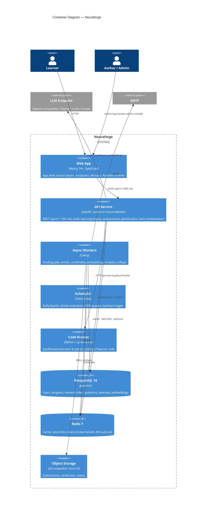

**Container inventory & systemd units**

| Container | Unit | Scale unit | State |
|---|---|---|---|
| Web App | `neuraforge-web.service` | N processes | stateless |
| API | `neuraforge-api.service` | Gunicorn workers ×(2·CPU+1) | stateless |
| Workers | `neuraforge-worker@.service` (templated: `default`, `grading`, `ai`) | per-queue instances | stateless |
| Beat | `neuraforge-beat.service` | exactly 1 (singleton lock in Redis) | stateless |
| Runner | `neuraforge-runner.service` | 1 per runner node | stateless (ephemeral workdirs) |
| PostgreSQL / Redis | distro units | vertical → managed/replica | stateful |

---

## 3. C4 Level 3 — Backend Components

The API service is a **modular monolith**: one deployable, strict internal module boundaries
(enforced by import-linter). Modules mirror SRS §3.

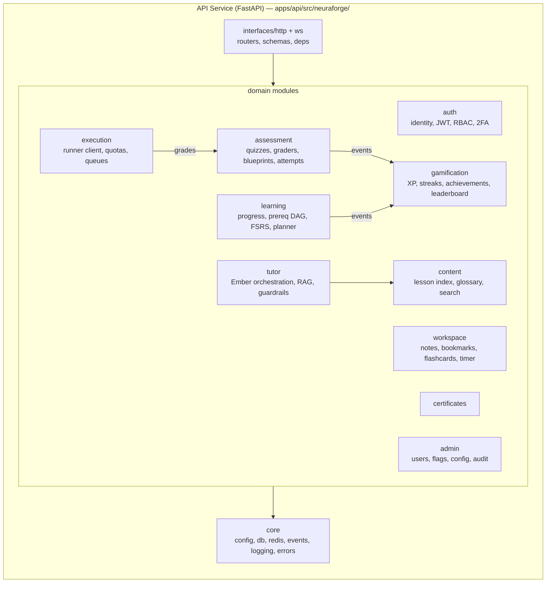

**Internal rules**

- Routers contain no business logic; each module exposes a `service.py` (use-cases), `repository.py` (SQLAlchemy), `schemas.py` (Pydantic), `models.py` (ORM), `events.py`.
- Cross-module communication: direct service calls for queries; **in-process domain events** (`core.events`, sync dispatch + Celery fan-out) for side effects — e.g. `ExercisePassed` → GAME awards XP, LEARN updates mastery. Keeps GAME rules server-authoritative (FR-GAME-1) and decoupled.
- `import-linter` contract: modules may import `core`, never each other's `repository`/`models` — only `service`/`events`/`schemas`.

---

## 4. C4 Level 3 — Frontend Structure

Next.js App Router; static-first rendering of lesson content, client islands for interactivity.

```mermaid
graph TB
    subgraph web["apps/web/src/"]
        APP[app/ routes<br/>(dashboard)/ (learn)/ (assess)/ (admin)/ auth/ verify/]
        FEAT[features/<br/>lesson-player · runner · quiz · tutor-panel<br/>gamification · notes · search · planner]
        VIZ[packages/viz-widgets<br/>11 named visualizers (FR-VIZ-2)<br/>D3 + Chart.js + Three.js]
        UIKIT[packages/ui<br/>design-system components, tokens]
        CLIENT[packages/api-client<br/>OpenAPI-generated, TanStack Query hooks]
        MDX[content runtime<br/>MDX components: Math, Mermaid, CodeCell, Quiz, Widget]
        PYO[pyodide runtime<br/>web worker + COOP/COEP, lazy-loaded]
    end
    APP --> FEAT --> UIKIT
    FEAT --> CLIENT
    FEAT --> MDX --> VIZ
    FEAT --> PYO
```

**Rendering strategy (ADR-0011):** lesson MDX is compiled at content-build time to React Server
Components → served static/ISR; interactive islands (`CodeCell`, `Widget`, `Quiz`) hydrate
client-side. Dashboard and progress views are dynamic (per-user). Pyodide loads in a Web Worker
only when a lesson declares an in-browser exercise; `Cross-Origin-Embedder-Policy`/`COOP`
headers set by Nginx for those routes (SharedArrayBuffer).

State management: TanStack Query for server state; Zustand for local UI state (editor buffers,
timer, theme); WS events invalidate queries (XP, grading results).

---

## 5. Domain Model (Class Diagram)

High-level conceptual model — attribute-complete schema lands in Phase 3.

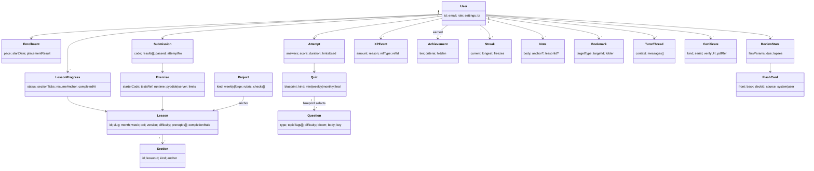

---

## 6. API Surface Design

Conventions (binding): `/api/v1` prefix · JSON · cursor pagination (`?cursor=&limit=`) ·
RFC 9457 problem+json errors · idempotency keys on unsafe retried POSTs (submissions) ·
OpenAPI 3.1 auto-published at `/api/v1/openapi.json` → generates `packages/api-client`.

**Resource map (top-level; ~detail in Phase 6):**

| Area | Endpoints (representative) |
|---|---|
| Auth | `POST /auth/register · /auth/login · /auth/refresh · /auth/logout · /auth/verify-email · /auth/password-reset · /auth/2fa/* · GET/DELETE /auth/sessions` |
| Me | `GET/PATCH /me · GET /me/export · DELETE /me` |
| Curriculum | `GET /curriculum` (syllabus tree) · `GET /lessons/{slug}` (compiled content ref + learner state) · `GET /glossary/{term}` |
| Progress | `PUT /progress/lessons/{id}/sections/{anchor}` · `GET /progress/summary` · `GET /stats` |
| Execution | `POST /exercises/{id}/runs` (ad-hoc run) · `POST /exercises/{id}/submissions` (graded) · `GET /submissions/{id}` |
| Assessment | `POST /quizzes/{id}/attempts` · `PATCH /attempts/{id}` (answer) · `POST /attempts/{id}/finish` · `GET /questions?filters` (practice/interview banks) |
| Projects | `GET /projects/{id}` · `POST /projects/{id}/submissions` |
| Study | `GET /planner/today` · `POST /reviews/{cardId}/grade` · CRUD `/notes /bookmarks /flashcards /decks` · `POST /timer/sessions` |
| Tutor | `POST /tutor/threads` · `POST /tutor/threads/{id}/messages` (SSE/WS stream) · `GET/DELETE /tutor/threads` |
| Gamification | `GET /xp · /achievements · /streak · /leaderboard` |
| Search | `GET /search?q=&types=` (FTS + semantic) |
| Certificates | `GET /certificates` · `GET /verify/{serial}` (public) |
| Admin | `/admin/users · /admin/flags · /admin/config · /admin/metrics · /admin/audit` |

**Auth model:** access JWT (15 min, EdDSA) in memory; refresh token rotating, httpOnly cookie
scoped to `/api/v1/auth`; CSRF double-submit token on cookie-using routes; WS authenticates via
short-lived one-time ticket (`POST /auth/ws-ticket`) to avoid tokens in query strings.

---

## 7. Real-Time Design (WebSockets)

Single learner socket `/ws` multiplexing typed channels; API instances are stateless — events
fan out via **Redis pub/sub** so any instance can serve any socket (P-4).

| Channel | Direction | Payloads |
|---|---|---|
| `run.{submissionId}` | S→C | stdout/stderr chunks, test results, status |
| `tutor.{threadId}` | S→C | token stream, citations, done |
| `game` | S→C | XP awarded, achievement unlocked, streak change |
| `presence` | C→S heartbeat | powers time-on-task (with visibility API) |

Fallback: SSE endpoints mirror `tutor.*` and `run.*` for restrictive networks; polling as last
resort. Message schema versioned (`v`, `type`, `data`).

---

## 8. Background Processing

Celery queues (Redis broker), templated worker units per queue:

| Queue | Jobs | Latency target |
|---|---|---|
| `grading` | server-side submission grading (invokes Runner), project checks | seconds |
| `ai` | embedding generation, Ember summaries/flash-card drafts, rubric pre-grades | seconds–minutes |
| `default` | emails, certificate PDF render, exports, webhooks | minutes |
| `periodic` (beat) | streak rollover per-timezone (hourly), FSRS due-queue build (daily), Daily Spark assignment, leaderboard rollup, analytics aggregates, backup trigger, cert-expiry checks | scheduled |

Rules: jobs idempotent (natural keys / upserts); results in PG not Redis for durable outcomes;
`beat` singleton via Redis lock; dead-letter queue with admin surface (FR-ADMIN-2).

---

## 9. Code Runner — Sandbox Deep Dive

Two execution tiers (ADR-0006), selected per-exercise by metadata (FR-RUN-3):

### 9.1 Tier 1 — Pyodide (in-browser, default for light exercises)

- Python 3.12 via WebAssembly in a **Web Worker**; numpy/micropip wheels preloaded per lesson manifest.
- Zero server risk, zero latency cost, works offline. Grading: same pytest-lite harness compiled to run in-worker; results posted to API for record (server re-verifies on submission for XP integrity — anti-cheat: server replay of final submission on Tier 2).
- Limits: worker terminated at 30 s wall; memory capped by browser.

### 9.2 Tier 2 — Server Runner (torch, plotting, big deps)

Dedicated service on the app node (baseline) or separate runner node (scale-out). **No containers** — defense-in-depth stack:

```mermaid
flowchart TB
    A[API enqueues run<br/>quota check FR-RUN-6] --> B[Runner service<br/>user nf-runner-svc]
    B --> C["systemd-run --user transient scope per run:<br/>MemoryMax=512M · CPUQuota=100% · TasksMax=64<br/>RuntimeMaxSec=30 · IPAddressDeny=any<br/>NoNewPrivileges · PrivateTmp · ProtectSystem=strict<br/>ProtectHome=yes · SystemCallFilter=@system-service minus @privileged<br/>ReadOnlyPaths=/opt/neuraforge/runtimes"]
    C --> D[exec user code<br/>uid nf-runner-exec (no shell)<br/>cwd = ephemeral tmpfs]
    D --> E[collect: stdout/stderr caps 256KB<br/>artifacts: matplotlib PNGs ≤ 5<br/>pytest JSON report]
    E --> F[wipe tmpfs · publish results<br/>Redis pub/sub → WS]
```

- **Runtime images without images:** pre-built read-only virtualenvs at `/opt/neuraforge/runtimes/{profile}` (e.g. `base`, `torch-cpu`, `viz`), each `uv sync --frozen` from a lockfile in-repo; exercises declare a profile. Rebuilding a profile = new directory + atomic symlink swap.
- **Escalation boundaries:** service user ≠ execution user; execution user has no network (`IPAddressDeny=any` + `RestrictAddressFamilies=AF_UNIX`), no home, no persistent writable path.
- **Grading integrity:** hidden tests stored outside the sandbox; harness imports learner module into the test process — learner code cannot read test source (separate mount, `InaccessiblePaths`); output sanitizer strips paths/test bodies.
- **Long-running training jobs (FR-RUN-7):** same mechanism, `RuntimeMaxSec` up to 600, routed via `grading` queue with WS log streaming; per-user concurrency 1.
- **Abuse controls:** per-user daily quotas in Redis; global concurrency semaphore; anomaly alerts (runs/min, OOM-kill rate).

Sandbox-escape test suite (SRS §8.2) runs in CI against a staging runner on every change to the runner service.

## 10. Ember (AI Tutor) Architecture

```mermaid
flowchart LR
    UI[Tutor panel] -->|message + consent ctx| ORCH[tutor.service<br/>orchestrator]
    ORCH --> GUARD[Guardrails<br/>mode policy · budget check<br/>assessment lockouts]
    GUARD --> CTX[Context builder<br/>lesson section · learner errors<br/>editor code (opt-in) · profile]
    CTX --> RAG[Retriever<br/>pgvector top-k over lessons/glossary<br/>+ FTS hybrid, rerank]
    RAG --> PROMPT[Prompt assembler<br/>server-side templates · mode: intuition/math/impl]
    PROMPT --> LLM[(OpenAI-compatible client<br/>Ollama / vLLM / hosted; retry+fallback chain)]
    LLM -->|stream| ORCH -->|WS tokens + citations| UI
    ORCH --> LOG[(threads · usage · cost<br/>PostgreSQL)]
```

Key decisions: prompts assembled **only server-side** (FR-TUTOR-5); hidden tests/exam keys are
in tables the tutor module has no repository access to (import-linter enforced); per-user daily
token budgets in Redis (FR-TUTOR-8); embeddings via same OpenAI-compatible endpoint or local
SentenceTransformers fallback; content embeddings refreshed by `ai` queue on content publish.

## 11. Content Pipeline (Content-as-Code)

```mermaid
flowchart LR
    SRC[content/&#42;&#42;/lesson.mdx + meta.yaml<br/>questions.yaml · decks.yaml] --> VAL[content-ci<br/>schema · links · prereq DAG acyclicity<br/>KaTeX/Mermaid compile · code samples execute<br/>quiz keys verified]
    VAL --> BUILD[compiler<br/>MDX → RSC payloads + section index<br/>search docs + embeddings jobs]
    BUILD --> ART[content artifact<br/>versioned tarball]
    ART --> PUB[publish job<br/>upsert content index in PG<br/>invalidate ISR · enqueue embeddings]
```

Learner progress anchors to **stable section anchors** (FR-CMS-4); the compiler fails if a
published anchor disappears without a `migrates-to` mapping.

---

## 12. Sequence Diagrams — Ten Core Flows

### 12.1 Registration & verification
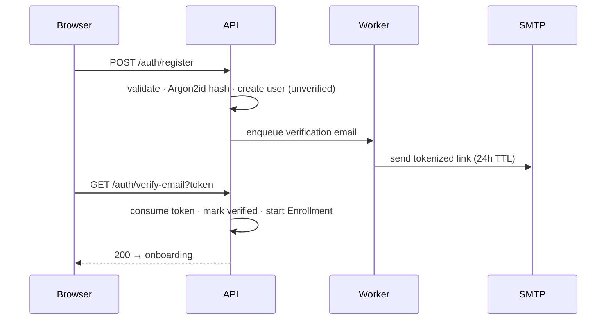

### 12.2 Login & silent refresh
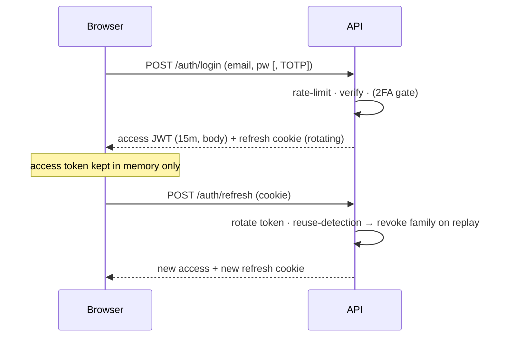

### 12.3 Lesson load & progress save
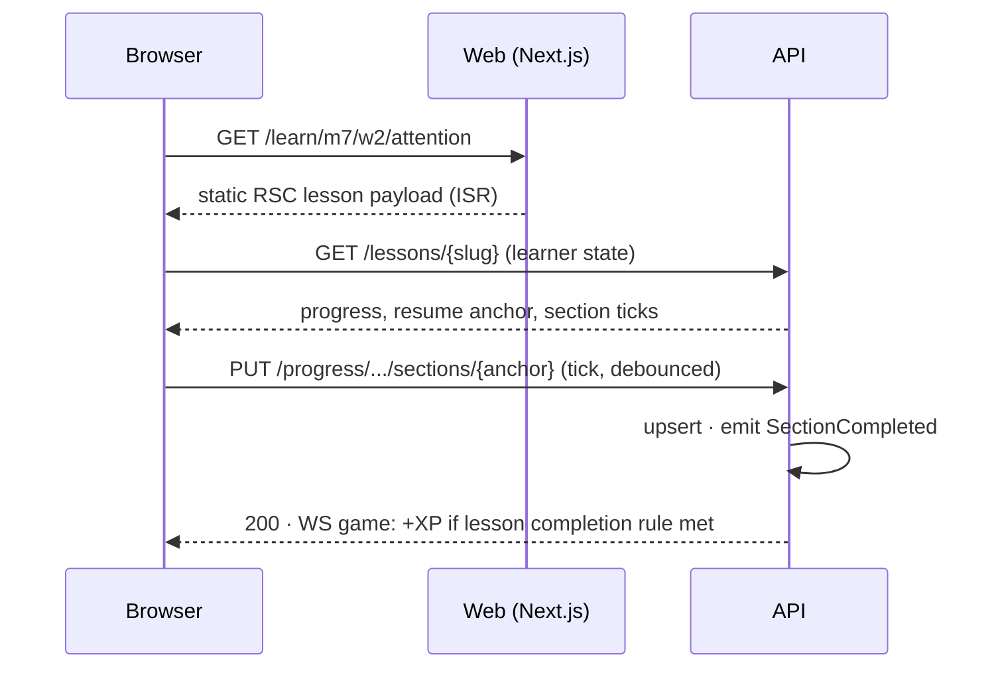

### 12.4 Run code — both tiers
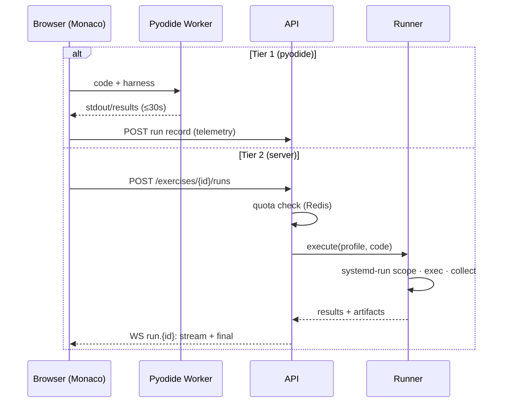

### 12.5 Graded submission
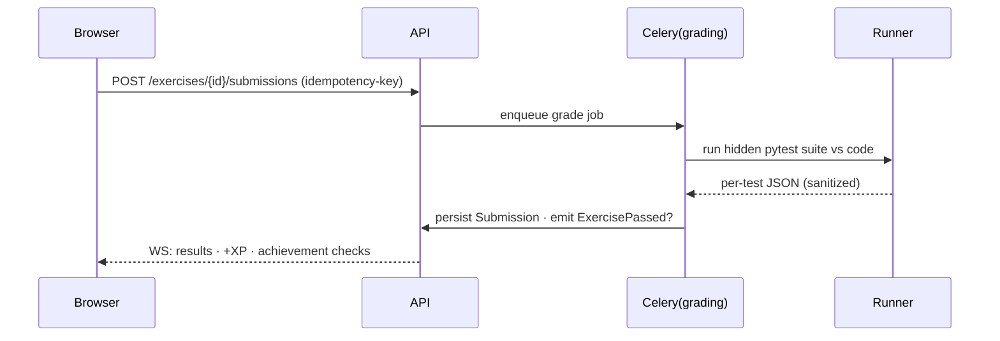

### 12.6 Quiz attempt
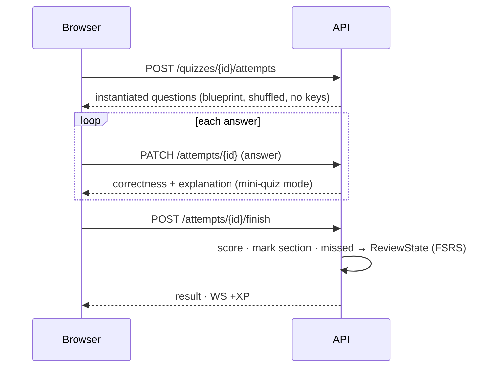

### 12.7 Ember chat with RAG
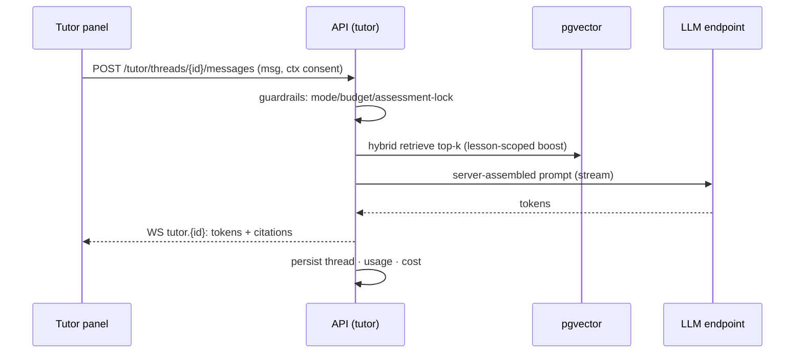

### 12.8 Streak & Daily Spark (per-timezone rollover)
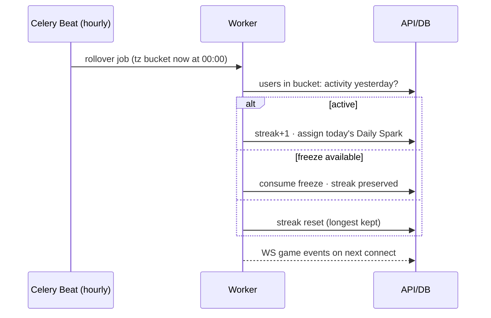

### 12.9 Certificate issue & verify
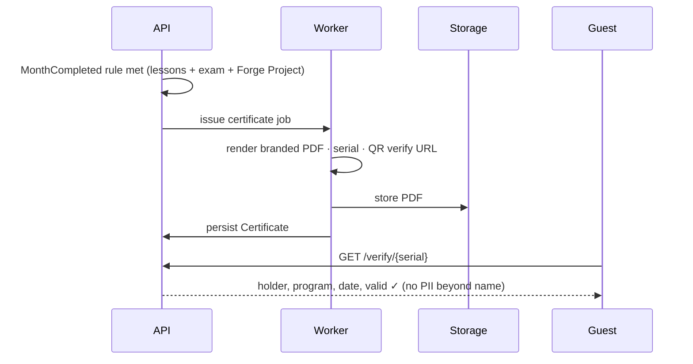

### 12.10 Content publish (author → production)
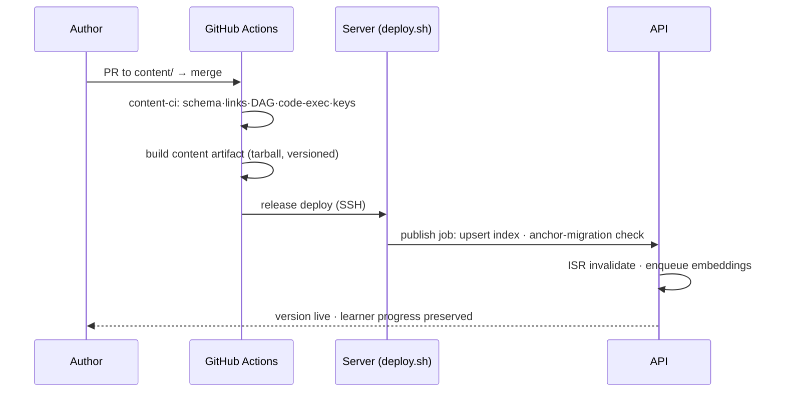

---

## 13. Deployment Topology & Scalability

Baseline single-node and the 4-step scale-out path are specified in SRS §10 (binding).
Additions at architecture level:

- **Release layout:** `/opt/neuraforge/releases/<ts>/` + `current` symlink; deploy = extract → `uv sync --frozen` → `alembic upgrade head` (advisory-locked) → health-gate → symlink swap → `systemctl reload neuraforge-api` (graceful). Rollback = re-point symlink + reload (DB migrations follow expand-migrate-contract discipline so N−1 code runs on N schema).
- **Nginx:** TLS termination, HTTP/2, static + `_next` assets with immutable cache headers, `/api` and `/ws` proxy (upgrade), COOP/COEP on Pyodide routes, rate-limit zones for auth endpoints.
- **Capacity notes:** NFR-PERF-5 (500 concurrent baseline) budgeted as: Next.js ~50 MB/proc ×4; API 9 Gunicorn workers × UvicornWorker (async, DB pool 15); Runner concurrency 4 × 512 MB; PG shared_buffers 2 GB — fits 8 GB reference VPS with headroom; k6 validation is a Phase 12 gate.

## 14. Security Architecture

Realizes SRS §9. Trust zones and the paths between them:

```mermaid
flowchart LR
    subgraph Z0[Zone 0 — Internet]
        B[Browser]
    end
    subgraph Z1[Zone 1 — Edge]
        N[Nginx: TLS · headers · rate zones]
    end
    subgraph Z2[Zone 2 — App (trusted)]
        WEB[web] --- API2[api] --- WK2[workers]
    end
    subgraph Z3[Zone 3 — Data]
        PG2[(PostgreSQL)] --- RD2[(Redis)]
    end
    subgraph Z4[Zone 4 — Radioactive]
        RN2[Runner exec scopes<br/>no network · no persistence]
    end
    B --> N --> WEB & API2
    API2 --> PG2 & RD2
    API2 -->|one-way HTTP, allowlisted| RN2
    WK2 --> PG2 & RD2
```

Zone 4 has exactly one ingress (Runner service API on loopback/private VLAN, token-authenticated)
and zero egress. Secrets: systemd `LoadCredential` per unit; DB roles per service with least
privilege (api: no DDL; worker: no auth tables write except its own; tutor module role denied
`SELECT` on hidden-test and exam-key tables — defense at DB layer, not just import-linter).

## 15. Observability

- **Metrics:** Prometheus scrape: FastAPI (prometheus-fastapi-instrumentator), Celery exporter, node_exporter, postgres_exporter, redis_exporter, Nginx stub_status. Golden dashboards: API latency/error budget, Runner queue+OOM, Ember tokens/cost/latency, learning funnel.
- **Logs:** structlog JSON → journald; request-id + user-id (hashed) correlation across web→api→worker→runner.
- **Errors:** Sentry (self-hosted or SaaS) FE+BE with release tagging from deploy script.
- **Alerts:** Alertmanager — disk >80%, 5xx >1%/5m, runner failure spike, cert expiry <14d, queue depth, backup job missed.

## 16. Monorepo Structure (Binding)

Expands SRS §11; this is the authoritative tree Phases 5+ implement.

```
neuraforge/
├── apps/
│   ├── web/                     # Next.js 14+ (TS strict)
│   │   ├── src/app/             # route groups: (dashboard) (learn) (assess) admin auth verify
│   │   ├── src/features/        # lesson-player runner quiz tutor gamification notes search planner
│   │   └── src/content-runtime/ # MDX component registry
│   └── api/                     # FastAPI (Python 3.12, uv)
│       ├── src/neuraforge/
│       │   ├── core/            # config db redis events logging errors security
│       │   ├── auth/ learning/ content/ assessment/ execution/
│       │   ├── tutor/ gamification/ workspace/ certificates/ admin/
│       │   └── interfaces/      # http/ ws/ (routers, deps)
│       ├── alembic/
│       └── tests/               # unit integration contract sandbox-escape
├── services/runner/             # runner service + runtime profiles (lockfiles)
├── packages/
│   ├── ui/  viz-widgets/  api-client/  config/   # shared TS
├── content/
│   ├── months/{01..12}/weeks/{1..4}/lessons/{1..5}/   # lesson.mdx + meta.yaml + exercises/ + deck.yaml
│   ├── questions/  projects/  glossary/  sparks/
│   └── schema/                  # JSON Schemas for all content types
├── tools/content-ci/            # validator + compiler (Python)
├── scripts/                     # provision.sh deploy.sh backup.sh restore.sh drift-check.sh
├── infra/                       # systemd units · nginx conf · prometheus rules (declarative, in-repo)
├── docs/                        # phases · adr · runbooks
└── .github/workflows/           # ci.yml content-ci.yml release.yml deploy.yml
```

## 17. Trade-offs & Rejected Alternatives

| Decision | Rejected | Why (full rationale in ADRs) |
|---|---|---|
| Modular monolith | Microservices | Single-team scale; ops budget without containers favors few units (ADR-0001) |
| systemd-run sandbox + Pyodide | gVisor/Firecracker/Docker | C-1 prohibits containers; Firecracker = heavier ops; chosen stack covers threat model with test suite (ADR-0006) |
| pgvector | Dedicated vector DB (Qdrant/Milvus) | One less stateful service; scale ceiling far above v1 needs (ADR-0008) |
| Celery+Redis | RQ / arq / Kafka | Beat + routing + maturity; Kafka is overkill (ADR-0009 companion) |
| Next.js RSC + islands | Full SPA | Content-heavy platform → static-first wins LCP budget (ADR-0011) |
| OpenAPI-generated TS client | Hand-written fetches | Contract drift eliminated (P-7) |

## 18. Phase Gate & Approval

**Phase 2 exit criteria:** owner approves (a) container/component decomposition, (b) two-tier
Runner design, (c) API conventions & auth model, (d) event-driven gamification coupling,
(e) ADR-0001…0011, (f) binding monorepo tree.

**Open decisions:**
1. Baseline VPS sizing confirmed at 4 vCPU/8 GB (NFR-PERF-5) — or size up-front for Ember local models (GPU node) at launch?
2. Sentry: self-hosted vs SaaS free tier?

Upon approval → **Phase 3: Database Design** (full ERD, DDL, per-table specs, indexes, migration
& seeding strategy, data-retention matrix).

---

*Neuraforge Architecture v1.0 — end of document.*
