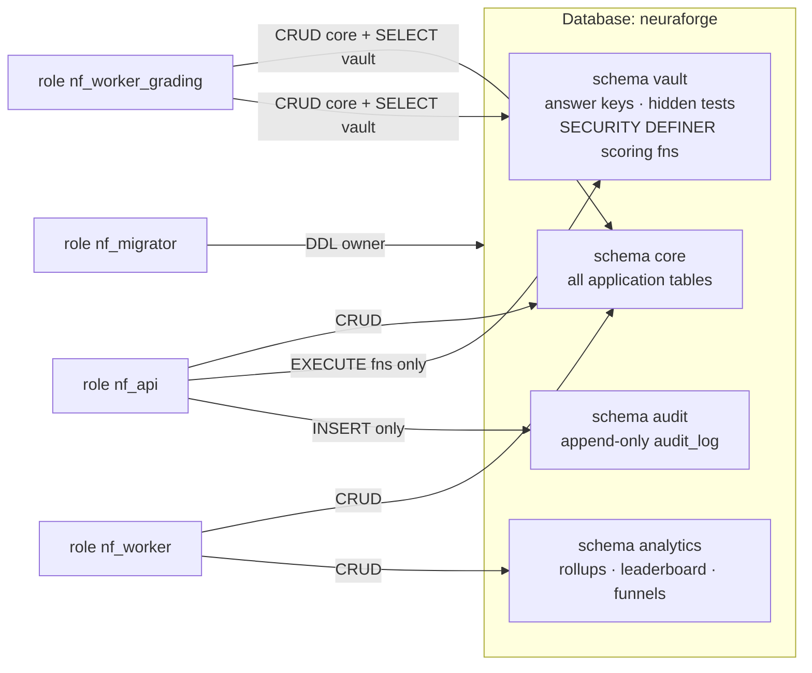
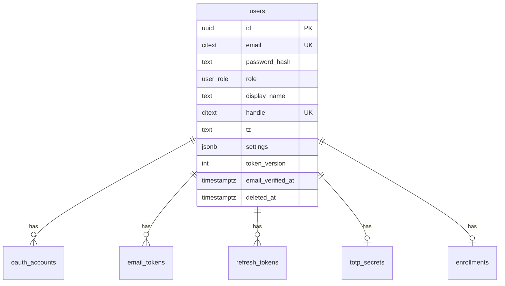
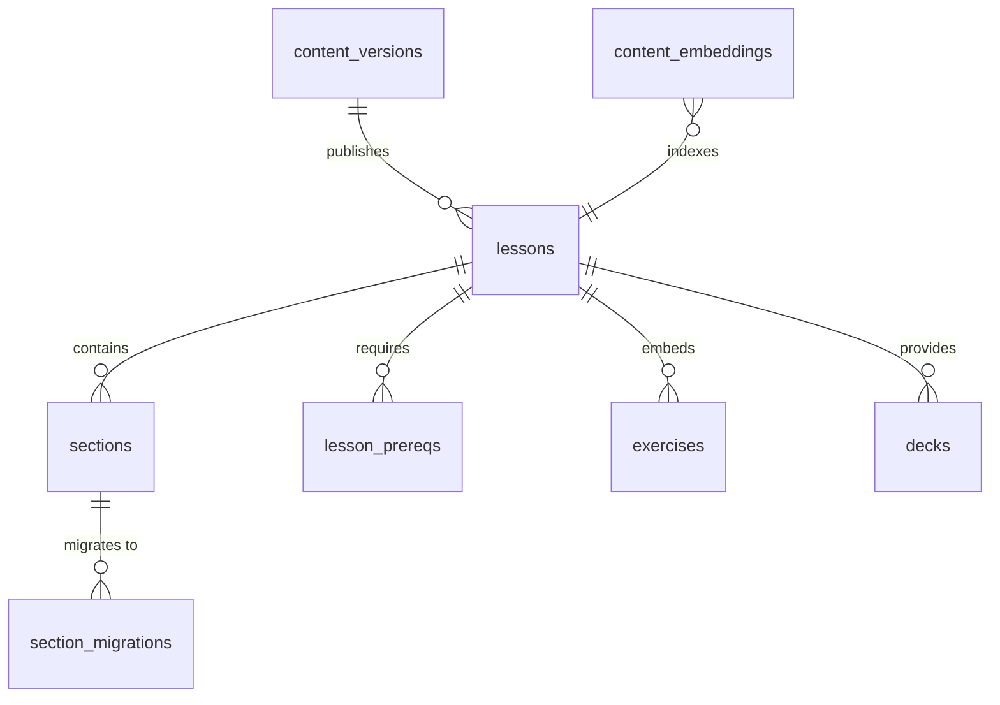
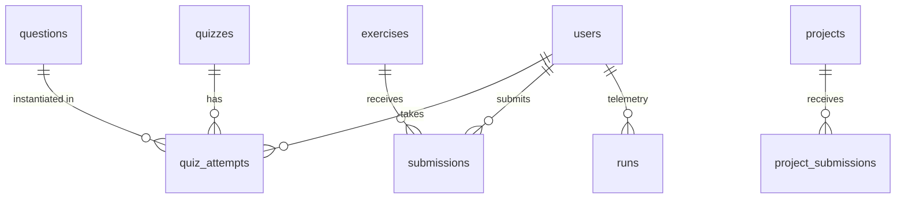

# Neuraforge — Database Design

| | |
|---|---|
| **Document** | Phase 3 — Database Design |
| **Version** | 1.0 (Draft for review) |
| **Date** | 2026-07-16 |
| **Depends on** | [SRS](../phase-01-srs/SRS.md) v1.0 · [Architecture](../phase-02-architecture/ARCHITECTURE.md) v1.0 (both approved) |
| **Engine** | PostgreSQL 16 + `pgvector`, `citext`, `pg_trgm` |

---

## Table of Contents

1. [Conventions & Global Decisions](#1-conventions--global-decisions)
2. [Schema Topology & Security Model](#2-schema-topology--security-model)
3. [ERD & DDL — Identity & Auth](#3-erd--ddl--identity--auth)
4. [ERD & DDL — Curriculum & Content](#4-erd--ddl--curriculum--content)
5. [ERD & DDL — Assessment & Execution](#5-erd--ddl--assessment--execution)
6. [ERD & DDL — Learning Progress & Study](#6-erd--ddl--learning-progress--study)
7. [ERD & DDL — Gamification](#7-erd--ddl--gamification)
8. [ERD & DDL — Workspace, Tutor, Certificates, Ops](#8-erd--ddl--workspace-tutor-certificates-ops)
9. [The Vault Schema (Answer Keys & Hidden Tests)](#9-the-vault-schema-answer-keys--hidden-tests)
10. [Database Roles & Grants](#10-database-roles--grants)
11. [Indexing Strategy Summary](#11-indexing-strategy-summary)
12. [Migration Strategy](#12-migration-strategy)
13. [Seeding Strategy](#13-seeding-strategy)
14. [Data Retention & Privacy Matrix](#14-data-retention--privacy-matrix)
15. [Growth, Partitioning & Capacity](#15-growth-partitioning--capacity)
16. [Phase Gate & Approval](#16-phase-gate--approval)

---

## 1. Conventions & Global Decisions

| Topic | Decision | Rationale |
|---|---|---|
| Primary keys | **UUIDv7** (`uuid` type, generated app-side via `uuid7()`) | Time-ordered → index-friendly inserts; no coordination; safe to expose |
| Timestamps | `timestamptz` always; `created_at DEFAULT now()`, `updated_at` via trigger | Timezone-correct (streaks are tz-sensitive) |
| Naming | `snake_case`; tables plural; FK columns `<entity>_id`; indexes `ix_<table>_<cols>`; unique `uq_`; checks `ck_` | Predictability |
| Enumerations | `text` + `CHECK` constraint for evolving sets; native `ENUM` only for frozen sets (`user_role`) | `ALTER TYPE` pain vs. check-constraint agility |
| Soft delete | Only `users` (FR-AUTH-7, 30-day purge); everything else hard-deletes with FK `ON DELETE` rules | Minimize tombstone complexity |
| JSONB | Allowed for genuinely polymorphic payloads (question bodies, FSRS params, rubric results); **never** for data we filter/join on hot paths | Schema-on-read only where variance is real |
| Money/costs | `numeric(12,6)` USD (Ember cost tracking) | No float money |
| Text search | Generated `tsvector` columns + GIN; `pg_trgm` for typo tolerance | FR-TOOLS-3 |
| Vectors | `vector(1024)` default dim; dimension recorded per embedding row set; HNSW cosine | ADR-0008; dim configurable at content-publish |
| ORM | SQLAlchemy 2.0 typed models mirror this DDL 1:1; Alembic owns DDL. This document is the design authority; migrations are the executable authority | Single source per fact (P-8) |

---

## 2. Schema Topology & Security Model

Four PostgreSQL schemas, one database (`neuraforge`):



The **vault** design is the load-bearing security decision (realizes SRS FR-TUTOR-5 and the
Phase 2 Zone model at the data layer): the API role **cannot SELECT** answer keys or hidden
test sources at all — quiz scoring goes through `SECURITY DEFINER` functions that accept an
answer and return only a verdict (§9). Even a fully prompt-injected Ember or an API-level SQLi
cannot exfiltrate keys through the API's own credentials.

---

## 3. ERD & DDL — Identity & Auth



```sql
CREATE TYPE user_role AS ENUM ('guest','learner','author','admin');  -- frozen set

CREATE TABLE core.users (
  id                uuid PRIMARY KEY,                         -- UUIDv7
  email             citext NOT NULL UNIQUE,
  password_hash     text,                                     -- NULL for OAuth-only accounts
  role              user_role NOT NULL DEFAULT 'learner',
  display_name      text NOT NULL,
  handle            citext UNIQUE,                            -- leaderboard alias (FR-GAME-4)
  tz                text NOT NULL DEFAULT 'UTC',              -- IANA name; drives streak rollover
  settings          jsonb NOT NULL DEFAULT '{}',              -- theme, consent flags, pace, leaderboard opt-in
  token_version     int NOT NULL DEFAULT 1,                   -- global JWT revoke (ADR-0007)
  email_verified_at timestamptz,
  deleted_at        timestamptz,                              -- soft delete; purge job after 30d
  created_at        timestamptz NOT NULL DEFAULT now(),
  updated_at        timestamptz NOT NULL DEFAULT now()
);
CREATE INDEX ix_users_deleted ON core.users (deleted_at) WHERE deleted_at IS NOT NULL;

CREATE TABLE core.oauth_accounts (
  user_id      uuid NOT NULL REFERENCES core.users ON DELETE CASCADE,
  provider     text NOT NULL CHECK (provider IN ('github','google')),
  provider_uid text NOT NULL,
  created_at   timestamptz NOT NULL DEFAULT now(),
  PRIMARY KEY (provider, provider_uid),
  UNIQUE (user_id, provider)
);

CREATE TABLE core.email_tokens (              -- verification + password reset (FR-AUTH-1/4)
  id          uuid PRIMARY KEY,
  user_id     uuid NOT NULL REFERENCES core.users ON DELETE CASCADE,
  purpose     text NOT NULL CHECK (purpose IN ('verify_email','password_reset')),
  token_hash  text NOT NULL UNIQUE,           -- store hash, never the token
  expires_at  timestamptz NOT NULL,
  consumed_at timestamptz,
  created_at  timestamptz NOT NULL DEFAULT now()
);

CREATE TABLE core.refresh_tokens (            -- rotating families w/ reuse detection (ADR-0007)
  id          uuid PRIMARY KEY,
  user_id     uuid NOT NULL REFERENCES core.users ON DELETE CASCADE,
  family_id   uuid NOT NULL,
  token_hash  text NOT NULL UNIQUE,
  ip          inet,
  user_agent  text,
  expires_at  timestamptz NOT NULL,
  rotated_at  timestamptz,                    -- non-NULL = superseded; use after this = reuse → revoke family
  revoked_at  timestamptz,
  created_at  timestamptz NOT NULL DEFAULT now()
);
CREATE INDEX ix_refresh_tokens_family ON core.refresh_tokens (family_id);
CREATE INDEX ix_refresh_tokens_user   ON core.refresh_tokens (user_id, expires_at);

CREATE TABLE core.totp_secrets (
  user_id        uuid PRIMARY KEY REFERENCES core.users ON DELETE CASCADE,
  secret_enc     bytea NOT NULL,              -- AES-GCM, key via systemd LoadCredential
  recovery_codes text[] NOT NULL,             -- Argon2id hashes
  confirmed_at   timestamptz
);

CREATE TABLE audit.audit_log (                -- append-only; INSERT-only grants (§10)
  id          uuid PRIMARY KEY,
  actor_id    uuid,                           -- nullable: system actions
  action      text NOT NULL,                  -- 'auth.login','admin.role_change','content.publish',...
  target_type text, target_id text,
  meta        jsonb NOT NULL DEFAULT '{}',
  ip          inet,
  created_at  timestamptz NOT NULL DEFAULT now()
);
CREATE INDEX ix_audit_actor_time ON audit.audit_log (actor_id, created_at DESC);
CREATE INDEX ix_audit_time ON audit.audit_log USING brin (created_at);
```

---

## 4. ERD & DDL — Curriculum & Content



```sql
CREATE TABLE core.content_versions (
  id           uuid PRIMARY KEY,
  version      text NOT NULL UNIQUE,          -- semver of the content artifact
  artifact_ref text NOT NULL,                 -- object-storage key of the tarball
  published_by uuid REFERENCES core.users,
  published_at timestamptz NOT NULL DEFAULT now()
);

CREATE TABLE core.lessons (
  id              uuid PRIMARY KEY,
  slug            text NOT NULL UNIQUE,        -- 'm07/w2/attention' — stable forever
  month           smallint NOT NULL CHECK (month BETWEEN 1 AND 12),
  week            smallint NOT NULL CHECK (week BETWEEN 1 AND 4),
  ord             smallint NOT NULL CHECK (ord BETWEEN 1 AND 5),
  title           text NOT NULL,
  difficulty      smallint NOT NULL CHECK (difficulty BETWEEN 1 AND 5),
  est_minutes     smallint NOT NULL,
  completion_rule jsonb NOT NULL DEFAULT '{"quiz_min": 70, "exercises": "all_required"}',
  meta            jsonb NOT NULL DEFAULT '{}', -- objectives, papers, videos, sample-lesson flag
  content_ref     text NOT NULL,               -- RSC payload key within the content artifact
  content_version uuid NOT NULL REFERENCES core.content_versions,
  status          text NOT NULL DEFAULT 'published' CHECK (status IN ('draft','published','archived')),
  updated_at      timestamptz NOT NULL DEFAULT now(),
  UNIQUE (month, week, ord)
);

CREATE TABLE core.lesson_prereqs (             -- DAG edges; acyclicity enforced by content-CI
  lesson_id uuid NOT NULL REFERENCES core.lessons ON DELETE CASCADE,
  prereq_id uuid NOT NULL REFERENCES core.lessons ON DELETE CASCADE,
  PRIMARY KEY (lesson_id, prereq_id),
  CHECK (lesson_id <> prereq_id)
);

CREATE TABLE core.sections (
  id        uuid PRIMARY KEY,
  lesson_id uuid NOT NULL REFERENCES core.lessons ON DELETE CASCADE,
  anchor    text NOT NULL,                     -- stable anchor (FR-CMS-4)
  kind      text NOT NULL CHECK (kind IN ('theory','history','applications','viz','worked_example',
             'derivation','walkthrough','optimization','exercise','practice','quiz','assignment',
             'project','summary','reading','references','flashcards')),
  ord       smallint NOT NULL,
  title     text NOT NULL,
  UNIQUE (lesson_id, anchor)
);

CREATE TABLE core.section_migrations (         -- anchor renames across content versions
  lesson_id       uuid NOT NULL REFERENCES core.lessons ON DELETE CASCADE,
  old_anchor      text NOT NULL,
  new_anchor      text NOT NULL,
  content_version uuid NOT NULL REFERENCES core.content_versions,
  PRIMARY KEY (lesson_id, old_anchor, content_version)
);

CREATE TABLE core.glossary_terms (
  slug       text PRIMARY KEY,
  term       text NOT NULL,
  definition_md text NOT NULL,
  notation   text,
  related    text[] NOT NULL DEFAULT '{}',
  tsv        tsvector GENERATED ALWAYS AS (to_tsvector('english', term || ' ' || definition_md)) STORED
);
CREATE INDEX ix_glossary_tsv ON core.glossary_terms USING gin (tsv);

CREATE TABLE core.content_embeddings (         -- RAG + semantic search (ADR-0008)
  id          uuid PRIMARY KEY,
  source_type text NOT NULL CHECK (source_type IN ('lesson_section','glossary','question','project')),
  source_id   uuid NOT NULL,
  lesson_id   uuid REFERENCES core.lessons ON DELETE CASCADE,   -- scope boost
  chunk_ord   smallint NOT NULL DEFAULT 0,
  body        text NOT NULL,
  embedding   vector(1024),
  model       text NOT NULL,                    -- embedding model id; re-embed on model change
  tsv         tsvector GENERATED ALWAYS AS (to_tsvector('english', body)) STORED,
  UNIQUE (source_type, source_id, chunk_ord, model)
);
CREATE INDEX ix_embed_hnsw ON core.content_embeddings USING hnsw (embedding vector_cosine_ops);
CREATE INDEX ix_embed_tsv  ON core.content_embeddings USING gin (tsv);
CREATE INDEX ix_embed_lesson ON core.content_embeddings (lesson_id);
```

---

## 5. ERD & DDL — Assessment & Execution



```sql
CREATE TABLE core.questions (
  id         uuid PRIMARY KEY,
  qtype      text NOT NULL CHECK (qtype IN ('mcq_single','mcq_multi','numeric','expression',
              'code_output','fill_blank','ordering','matching','free_text')),
  bank       text NOT NULL CHECK (bank IN ('practice','interview','research','spark','exam_only')),
  body       jsonb NOT NULL,                  -- stem, options, blanks… (schema per qtype in content/schema)
  explanation jsonb NOT NULL DEFAULT '{}',    -- per-option explanations (FR-ASSESS-2) — NOT the key
  topic_tags text[] NOT NULL,
  month      smallint, week smallint,
  difficulty smallint NOT NULL CHECK (difficulty BETWEEN 1 AND 5),
  bloom      text CHECK (bloom IN ('remember','understand','apply','analyze','evaluate','create')),
  stats      jsonb NOT NULL DEFAULT '{}',     -- item analytics: p-value, discrimination (FR-CMS-5)
  status     text NOT NULL DEFAULT 'published' CHECK (status IN ('draft','published','retired')),
  content_version uuid REFERENCES core.content_versions,
  tsv        tsvector GENERATED ALWAYS AS (to_tsvector('english', body::text)) STORED
);
CREATE INDEX ix_questions_bank  ON core.questions (bank, month, difficulty) WHERE status='published';
CREATE INDEX ix_questions_tags  ON core.questions USING gin (topic_tags);
CREATE INDEX ix_questions_tsv   ON core.questions USING gin (tsv);
-- Answer keys live in vault.question_keys (§9), NOT here.

CREATE TABLE core.quizzes (
  id             uuid PRIMARY KEY,
  kind           text NOT NULL CHECK (kind IN ('mini','weekly','monthly','final')),
  lesson_id      uuid REFERENCES core.lessons ON DELETE CASCADE,  -- mini quizzes
  month          smallint, week smallint,
  blueprint      jsonb NOT NULL,              -- topic × difficulty × qtype distribution (FR-ASSESS-3)
  pass_threshold smallint NOT NULL DEFAULT 70,
  time_limit_s   int
);

CREATE TABLE core.quiz_attempts (
  id           uuid PRIMARY KEY,
  quiz_id      uuid NOT NULL REFERENCES core.quizzes,
  user_id      uuid NOT NULL REFERENCES core.users ON DELETE CASCADE,
  question_ids uuid[] NOT NULL,               -- instantiated selection (randomized)
  answers      jsonb NOT NULL DEFAULT '{}',   -- question_id → {answer, correct, answered_at}
  score        numeric(5,2),
  hints_used   smallint NOT NULL DEFAULT 0,
  started_at   timestamptz NOT NULL DEFAULT now(),
  finished_at  timestamptz
);
CREATE INDEX ix_attempts_user ON core.quiz_attempts (user_id, started_at DESC);
CREATE INDEX ix_attempts_quiz ON core.quiz_attempts (quiz_id);

CREATE TABLE core.exercises (
  id           uuid PRIMARY KEY,
  lesson_id    uuid NOT NULL REFERENCES core.lessons ON DELETE CASCADE,
  ord          smallint NOT NULL,
  title        text NOT NULL,
  required     boolean NOT NULL DEFAULT true, -- feeds completion_rule
  runtime      text NOT NULL CHECK (runtime IN ('pyodide','server')),
  profile      text NOT NULL DEFAULT 'base',  -- runtime profile (ADR-0006)
  starter_code text NOT NULL,
  limits       jsonb NOT NULL DEFAULT '{"wall_s":30,"mem_mb":512}',
  hints        jsonb NOT NULL DEFAULT '[]',   -- progressive, XP-costed (FR-ASSESS-5)
  content_version uuid REFERENCES core.content_versions,
  UNIQUE (lesson_id, ord)
);
-- Hidden test sources live in vault.exercise_tests (§9).

CREATE TABLE core.submissions (
  id              uuid PRIMARY KEY,
  exercise_id     uuid NOT NULL REFERENCES core.exercises,
  user_id         uuid NOT NULL REFERENCES core.users ON DELETE CASCADE,
  code            text NOT NULL,
  attempt_no      smallint NOT NULL,
  status          text NOT NULL DEFAULT 'queued'
                  CHECK (status IN ('queued','running','passed','failed','error','timeout')),
  results         jsonb NOT NULL DEFAULT '[]',  -- sanitized per-test verdicts
  tier            text NOT NULL CHECK (tier IN ('pyodide','server')),
  idempotency_key text,
  created_at      timestamptz NOT NULL DEFAULT now(),
  graded_at       timestamptz,
  UNIQUE (user_id, exercise_id, attempt_no)
);
CREATE UNIQUE INDEX uq_submissions_idem ON core.submissions (user_id, idempotency_key)
  WHERE idempotency_key IS NOT NULL;
CREATE INDEX ix_submissions_user_ex ON core.submissions (user_id, exercise_id, created_at DESC);

CREATE TABLE core.runs (                       -- ad-hoc run telemetry + quota accounting
  id          uuid PRIMARY KEY,
  user_id     uuid NOT NULL REFERENCES core.users ON DELETE CASCADE,
  exercise_id uuid REFERENCES core.exercises,
  tier        text NOT NULL CHECK (tier IN ('pyodide','server')),
  status      text NOT NULL,
  duration_ms int,
  created_at  timestamptz NOT NULL DEFAULT now()
);
CREATE INDEX ix_runs_user_time ON core.runs (user_id, created_at DESC);
CREATE INDEX ix_runs_brin ON core.runs USING brin (created_at);

CREATE TABLE core.projects (
  id        uuid PRIMARY KEY,
  kind      text NOT NULL CHECK (kind IN ('weekly','forge')),
  month     smallint NOT NULL, week smallint,   -- week NULL for forge
  title     text NOT NULL,
  brief_ref text NOT NULL,                      -- MDX brief in content artifact
  rubric    jsonb NOT NULL,
  checks    jsonb NOT NULL,                     -- autograded check specs (FR-ASSESS-6)
  content_version uuid REFERENCES core.content_versions,
  UNIQUE (kind, month, week)
);

CREATE TABLE core.project_submissions (
  id              uuid PRIMARY KEY,
  project_id      uuid NOT NULL REFERENCES core.projects,
  user_id         uuid NOT NULL REFERENCES core.users ON DELETE CASCADE,
  artifact_ref    text NOT NULL,                -- object-storage key (repo tarball / files)
  check_results   jsonb NOT NULL DEFAULT '{}',
  self_assessment jsonb NOT NULL DEFAULT '{}',
  ember_review    jsonb,                        -- optional AI review (FR-ASSESS-6)
  status          text NOT NULL DEFAULT 'submitted'
                  CHECK (status IN ('submitted','checking','passed','failed','resubmit')),
  submitted_at    timestamptz NOT NULL DEFAULT now(),
  graded_at       timestamptz
);
CREATE INDEX ix_proj_sub_user ON core.project_submissions (user_id, project_id, submitted_at DESC);
```

---

## 6. ERD & DDL — Learning Progress & Study

```sql
CREATE TABLE core.enrollments (
  user_id    uuid PRIMARY KEY REFERENCES core.users ON DELETE CASCADE,
  started_on date NOT NULL DEFAULT CURRENT_DATE,
  pace       jsonb NOT NULL DEFAULT '{"lessons_per_week": 5}',   -- FR-DASH-6
  placement  jsonb                                                -- diagnostic outcome (FR-LEARN-4)
);

CREATE TABLE core.lesson_progress (
  user_id       uuid NOT NULL REFERENCES core.users ON DELETE CASCADE,
  lesson_id     uuid NOT NULL REFERENCES core.lessons ON DELETE CASCADE,
  status        text NOT NULL DEFAULT 'not_started'
                CHECK (status IN ('not_started','in_progress','completed')),
  section_ticks jsonb NOT NULL DEFAULT '{}',   -- anchor → ticked_at
  resume_anchor text,                          -- FR-LESSON-7
  completed_by  text CHECK (completed_by IN ('normal','placement')),
  started_at    timestamptz,
  completed_at  timestamptz,
  updated_at    timestamptz NOT NULL DEFAULT now(),
  PRIMARY KEY (user_id, lesson_id)
);
CREATE INDEX ix_progress_user_status ON core.lesson_progress (user_id, status);

CREATE TABLE core.decks (
  id        uuid PRIMARY KEY,
  lesson_id uuid REFERENCES core.lessons ON DELETE CASCADE,  -- NULL = user deck
  owner_id  uuid REFERENCES core.users ON DELETE CASCADE,    -- NULL = system deck
  title     text NOT NULL,
  CHECK (lesson_id IS NOT NULL OR owner_id IS NOT NULL)
);

CREATE TABLE core.flash_cards (
  id       uuid PRIMARY KEY,
  deck_id  uuid NOT NULL REFERENCES core.decks ON DELETE CASCADE,
  owner_id uuid REFERENCES core.users ON DELETE CASCADE,     -- NULL = system card
  front_md text NOT NULL,
  back_md  text NOT NULL,
  source   jsonb NOT NULL DEFAULT '{}'         -- lesson/section provenance, missed-question ref
);
CREATE INDEX ix_cards_deck ON core.flash_cards (deck_id);

CREATE TABLE core.review_states (              -- FSRS scheduler state (FR-LEARN-2)
  user_id     uuid NOT NULL REFERENCES core.users ON DELETE CASCADE,
  card_id     uuid NOT NULL REFERENCES core.flash_cards ON DELETE CASCADE,
  fsrs        jsonb NOT NULL,                  -- stability, difficulty, state
  due_at      timestamptz NOT NULL,
  reps        int NOT NULL DEFAULT 0,
  lapses      int NOT NULL DEFAULT 0,
  last_review timestamptz,
  PRIMARY KEY (user_id, card_id)
);
CREATE INDEX ix_reviews_due ON core.review_states (user_id, due_at);

CREATE TABLE core.review_logs (
  id          uuid PRIMARY KEY,
  user_id     uuid NOT NULL REFERENCES core.users ON DELETE CASCADE,
  card_id     uuid NOT NULL,
  grade       smallint NOT NULL CHECK (grade BETWEEN 1 AND 4),   -- again/hard/good/easy
  elapsed_s   int,
  reviewed_at timestamptz NOT NULL DEFAULT now()
);
CREATE INDEX ix_review_logs_brin ON core.review_logs USING brin (reviewed_at);

CREATE TABLE core.spark_assignments (          -- Daily Sparks (FR-LEARN-5)
  user_id      uuid NOT NULL REFERENCES core.users ON DELETE CASCADE,
  for_date     date NOT NULL,                  -- in user's tz
  ref_type     text NOT NULL CHECK (ref_type IN ('question','exercise')),
  ref_id       uuid NOT NULL,
  completed_at timestamptz,
  PRIMARY KEY (user_id, for_date)
);

CREATE TABLE core.study_sessions (             -- timer (FR-TOOLS-5) + time-on-task
  id         uuid PRIMARY KEY,
  user_id    uuid NOT NULL REFERENCES core.users ON DELETE CASCADE,
  kind       text NOT NULL DEFAULT 'pomodoro' CHECK (kind IN ('pomodoro','free','presence')),
  topic_tag  text,
  lesson_id  uuid REFERENCES core.lessons ON DELETE SET NULL,
  started_at timestamptz NOT NULL,
  ended_at   timestamptz,
  CHECK (ended_at IS NULL OR ended_at > started_at)
);
CREATE INDEX ix_study_user_time ON core.study_sessions (user_id, started_at DESC);
```

---

## 7. ERD & DDL — Gamification

```sql
CREATE TABLE core.xp_events (                  -- server-authoritative XP ledger (FR-GAME-1)
  id         uuid PRIMARY KEY,
  user_id    uuid NOT NULL REFERENCES core.users ON DELETE CASCADE,
  amount     int NOT NULL,                     -- negative allowed (hint costs)
  reason     text NOT NULL CHECK (reason IN ('lesson_complete','quiz_score','exercise_pass',
              'exercise_first_try','daily_spark','weekly_project','forge_project','review_session',
              'hint_cost','achievement_bonus','placement')),
  ref_type   text NOT NULL,
  ref_id     uuid NOT NULL,
  created_at timestamptz NOT NULL DEFAULT now()
);
-- one award per (user, reason, referenced object) — double-award impossible at the DB layer:
CREATE UNIQUE INDEX uq_xp_once ON core.xp_events (user_id, reason, ref_type, ref_id)
  WHERE reason <> 'hint_cost';
CREATE INDEX ix_xp_user_time ON core.xp_events (user_id, created_at DESC);
CREATE INDEX ix_xp_brin ON core.xp_events USING brin (created_at);

CREATE TABLE core.achievements (               -- seeded catalog (FR-GAME-3)
  id       text PRIMARY KEY,                   -- slug: 'first-forge','streak-30',…
  tier     text NOT NULL CHECK (tier IN ('iron','bronze','steel','damascus','mythril')),
  title    text NOT NULL,
  descr    text NOT NULL,
  criteria jsonb NOT NULL,                     -- machine-evaluable predicate spec
  hidden   boolean NOT NULL DEFAULT false
);

CREATE TABLE core.user_achievements (
  user_id        uuid NOT NULL REFERENCES core.users ON DELETE CASCADE,
  achievement_id text NOT NULL REFERENCES core.achievements,
  earned_at      timestamptz NOT NULL DEFAULT now(),
  PRIMARY KEY (user_id, achievement_id)
);

CREATE TABLE core.streaks (
  user_id          uuid PRIMARY KEY REFERENCES core.users ON DELETE CASCADE,
  current          int NOT NULL DEFAULT 0,
  longest          int NOT NULL DEFAULT 0,
  freezes          smallint NOT NULL DEFAULT 0,        -- max 2/month earnable (FR-GAME-2)
  last_active_date date,                               -- in user's tz
  updated_at       timestamptz NOT NULL DEFAULT now()
);

CREATE TABLE analytics.leaderboard_weekly (    -- rollup by worker; opt-in filter applied at write
  iso_week   text NOT NULL,                    -- '2026-W29'
  user_id    uuid NOT NULL,
  handle     text NOT NULL,                    -- denormalized alias at rollup time
  xp         int NOT NULL,
  rank       int NOT NULL,
  PRIMARY KEY (iso_week, user_id)
);
CREATE INDEX ix_leaderboard_rank ON analytics.leaderboard_weekly (iso_week, rank);
```

---

## 8. ERD & DDL — Workspace, Tutor, Certificates, Ops

```sql
CREATE TABLE core.notes (
  id         uuid PRIMARY KEY,
  user_id    uuid NOT NULL REFERENCES core.users ON DELETE CASCADE,
  lesson_id  uuid REFERENCES core.lessons ON DELETE SET NULL,   -- NULL = global notebook
  anchor     text,                                              -- margin note (FR-TOOLS-1)
  body_md    text NOT NULL,
  tsv        tsvector GENERATED ALWAYS AS (to_tsvector('english', body_md)) STORED,
  updated_at timestamptz NOT NULL DEFAULT now()
);
CREATE INDEX ix_notes_user_lesson ON core.notes (user_id, lesson_id);
CREATE INDEX ix_notes_tsv ON core.notes USING gin (tsv);

CREATE TABLE core.bookmarks (
  id          uuid PRIMARY KEY,
  user_id     uuid NOT NULL REFERENCES core.users ON DELETE CASCADE,
  target_type text NOT NULL CHECK (target_type IN ('lesson','section','question','viz_state')),
  target_id   text NOT NULL,                   -- uuid or composite anchor key
  folder      text NOT NULL DEFAULT 'default',
  state       jsonb,                           -- saved visualizer state (FR-TOOLS-2)
  created_at  timestamptz NOT NULL DEFAULT now(),
  UNIQUE (user_id, target_type, target_id)
);

CREATE TABLE core.tutor_threads (
  id         uuid PRIMARY KEY,
  user_id    uuid NOT NULL REFERENCES core.users ON DELETE CASCADE,
  title      text,
  context    jsonb NOT NULL DEFAULT '{}',      -- lesson scope, mode
  created_at timestamptz NOT NULL DEFAULT now()
);

CREATE TABLE core.tutor_messages (
  id         uuid PRIMARY KEY,
  thread_id  uuid NOT NULL REFERENCES core.tutor_threads ON DELETE CASCADE,
  role       text NOT NULL CHECK (role IN ('user','assistant','system_note')),
  content    text NOT NULL,
  citations  jsonb NOT NULL DEFAULT '[]',
  tokens_in  int, tokens_out int,
  cost_usd   numeric(12,6),
  created_at timestamptz NOT NULL DEFAULT now()
);
CREATE INDEX ix_tutor_msgs_thread ON core.tutor_messages (thread_id, created_at);

CREATE TABLE core.tutor_usage_daily (          -- budget enforcement (FR-TUTOR-8)
  user_id  uuid NOT NULL REFERENCES core.users ON DELETE CASCADE,
  for_date date NOT NULL,
  tokens   bigint NOT NULL DEFAULT 0,
  cost_usd numeric(12,6) NOT NULL DEFAULT 0,
  PRIMARY KEY (user_id, for_date)
);

CREATE TABLE core.certificates (
  id         uuid PRIMARY KEY,
  user_id    uuid NOT NULL REFERENCES core.users ON DELETE CASCADE,
  kind       text NOT NULL CHECK (kind IN ('month','forgemaster')),
  month      smallint CHECK (month BETWEEN 1 AND 12),   -- NULL for forgemaster
  serial     text NOT NULL UNIQUE,             -- public verify key (FR-CERT-2)
  holder_name text NOT NULL,                   -- frozen at issue time
  pdf_ref    text NOT NULL,
  issued_at  timestamptz NOT NULL DEFAULT now(),
  revoked_at timestamptz,
  UNIQUE (user_id, kind, month)
);

CREATE TABLE core.feature_flags (
  key        text PRIMARY KEY,
  value      jsonb NOT NULL,
  updated_by uuid REFERENCES core.users,
  updated_at timestamptz NOT NULL DEFAULT now()
);

CREATE TABLE core.app_config (                 -- Ember provider, quotas, budgets (FR-ADMIN-1)
  key        text PRIMARY KEY,
  value      jsonb NOT NULL,                   -- secrets stay in env/LoadCredential, never here
  updated_by uuid REFERENCES core.users,
  updated_at timestamptz NOT NULL DEFAULT now()
);

CREATE TABLE core.announcements (
  id         uuid PRIMARY KEY,
  title      text NOT NULL,
  body_md    text NOT NULL,
  level      text NOT NULL DEFAULT 'info' CHECK (level IN ('info','warning','maintenance')),
  starts_at  timestamptz NOT NULL,
  ends_at    timestamptz,
  created_by uuid REFERENCES core.users
);
```

---

## 9. The Vault Schema (Answer Keys & Hidden Tests)

**Threat model:** a prompt-injected Ember, a compromised API process, or an over-broad query
must not be able to read exam keys or hidden test sources (SRS FR-TUTOR-5, §8.2 guardrail suite).

```sql
CREATE SCHEMA vault;

CREATE TABLE vault.question_keys (
  question_id uuid PRIMARY KEY REFERENCES core.questions ON DELETE CASCADE,
  key         jsonb NOT NULL          -- correct options / numeric target+tolerance / regex / sympy expr / rubric
);

CREATE TABLE vault.exercise_tests (
  exercise_id uuid PRIMARY KEY REFERENCES core.exercises ON DELETE CASCADE,
  tests_source text NOT NULL,         -- pytest module source
  solution_source text                -- reference solution (unlock rules enforced in app layer)
);

-- Scoring without key exposure: API may EXECUTE, may not SELECT.
CREATE FUNCTION vault.score_answer(p_question uuid, p_answer jsonb)
RETURNS jsonb                          -- {correct: bool, partial: numeric|null}
LANGUAGE plpgsql SECURITY DEFINER SET search_path = vault, core AS $$
  -- dispatches on core.questions.qtype; compares against vault.question_keys.key;
  -- returns verdict only — never echoes the key. Body finalized in Phase 6.
$$;

CREATE FUNCTION vault.reveal_solution(p_exercise uuid, p_user uuid)
RETURNS text LANGUAGE plpgsql SECURITY DEFINER AS $$
  -- returns solution_source ONLY if core.submissions shows (passed) OR (attempt_no >= 3)
  -- for (p_user, p_exercise) — the FR-ASSESS-5 unlock rule enforced at the data layer.
$$;
```

Grading workers (`nf_worker_grading`) get direct `SELECT` on `vault.exercise_tests` — they must
ship test sources to the Runner. The Runner itself has **no DB access at all**; tests arrive in
the job payload and hidden sources never touch the sandbox-readable filesystem (ADR-0006).

## 10. Database Roles & Grants

| Role | core | vault | audit | analytics | DDL |
|---|---|---|---|---|---|
| `nf_migrator` (deploy only) | owner | owner | owner | owner | ✅ Alembic |
| `nf_api` | CRUD (table-scoped) | **EXECUTE fns only** | INSERT only | SELECT | ❌ |
| `nf_worker` | CRUD | ❌ | INSERT | CRUD | ❌ |
| `nf_worker_grading` | CRUD (submissions, exercises R) | SELECT | INSERT | ❌ | ❌ |
| `nf_readonly` (humans, dashboards) | SELECT (PII-masked views) | ❌ | SELECT | SELECT | ❌ |

Additional hard rules: `REVOKE ALL ON SCHEMA vault FROM PUBLIC`; `audit.audit_log` has a
`REVOKE UPDATE, DELETE` + trigger guard (append-only even for owner in normal operation);
`nf_api` connection string is the **only** one in the API's systemd credentials.

## 11. Indexing Strategy Summary

| Pattern | Choice |
|---|---|
| Hot per-user lookups (progress, attempts, reviews due) | B-tree composite `(user_id, …)` — listed inline above |
| Time-series scans (xp, runs, logs, audit) | BRIN on `created_at` + targeted B-trees for recent-window queries |
| Search | GIN on generated `tsvector`; `pg_trgm` GIN on `lessons.title`, `glossary_terms.term` for typo tolerance |
| Vectors | HNSW cosine (`m=16, ef_construction=64` initial; tuned in Phase 12 load test) |
| Idempotency / integrity | Partial unique indexes (`uq_xp_once`, `uq_submissions_idem`) — correctness enforced in the DB, not just app code |

## 12. Migration Strategy

1. **Tooling:** Alembic; autogenerate diffs against the SQLAlchemy models, always hand-reviewed; one migration per PR max; no edits to merged migrations.
2. **Zero-downtime discipline (expand–migrate–contract):** additive DDL first (nullable column/new table + dual-write), backfill via batched data migration (separate revision, `server_default` avoided on big tables), contract (drop/rename) only after the release running the new code is verified — N−1 code must always run on N schema (Architecture §13 rollback contract).
3. **Locks:** `alembic upgrade head` runs inside `deploy.sh` under a PG advisory lock; statements needing table rewrites are flagged in review (checklist: `lock_timeout=5s`, `statement_timeout` set; `CREATE INDEX CONCURRENTLY` outside transactions).
4. **Vault objects:** functions are versioned as idempotent `CREATE OR REPLACE` migrations with their tests in `apps/api/tests/vault/`.
5. **Drift guard:** CI job runs `alembic check` (models ⇄ migrations) and asserts a scratch DB built from migrations matches `pg_dump --schema-only` of the reference schema.

## 13. Seeding Strategy

| Seed set | Source | When |
|---|---|---|
| Achievements catalog (≥60) | `content/gamification/achievements.yaml` | every deploy (upsert by slug) |
| Curriculum index (lessons/sections/questions/exercises/projects/decks/glossary) | content artifact publish job (ADR-0005) | on content publish |
| Question keys & hidden tests → vault | same artifact, split stream loaded under `nf_migrator` during publish | on content publish |
| Embeddings | `ai` queue post-publish | async |
| App config defaults, feature flags | `infra/seeds/config.yaml` | first boot (insert-if-absent) |
| Dev/demo data (3 personas at month 1/5/9 progress, sample attempts) | `apps/api/tests/factories` (factory-boy) → `scripts/seed-dev.py` | dev/staging only, guarded by `ENV != production` |

## 14. Data Retention & Privacy Matrix

| Data | Retention | Erasure on account delete (FR-AUTH-7) |
|---|---|---|
| User profile, settings | life of account; 30-day purge after soft delete | purged |
| Progress, attempts, submissions, XP | life of account | purged |
| Learner code (submissions) | life of account | purged; never used for training without opt-in (NFR-PRIV-1) |
| Tutor threads/messages | until user deletes; max 1 year inactive → summarized+pruned by job | purged |
| Tutor usage rollups | 2 years (billing/ops), de-identified after purge | anonymized (user_id → tombstone) |
| Refresh/email tokens | expired rows purged after 30/7 days | purged |
| Runs telemetry | 90 days raw → aggregated | purged |
| Review logs | 2 years raw → aggregated | purged |
| Audit log | 2 years, append-only | **retained** (legitimate interest; actor pseudonymized) |
| Certificates | permanent (public verification) | retained unless revocation requested; holder may request name redaction |
| Analytics rollups | permanent, aggregate-only (k≥10 anonymity for cohort stats) | n/a |
| Backups | 30 daily / 12 monthly; erasure honored on restore via purge replay | via purge replay |

Purge jobs run on the `periodic` queue; every purge writes an audit entry.

## 15. Growth, Partitioning & Capacity

Projection at 10k active learners/year: `xp_events` ~15M rows/yr, `review_logs` ~20M/yr,
`runs` ~10M/yr, `tutor_messages` ~5M/yr — all comfortably in single tables with BRIN for years.
**Decision:** no partitioning at v1; `xp_events`, `review_logs`, `runs`, `audit_log` are
designed partition-ready (PK includes time-ordered UUIDv7; no cross-partition FKs) so native
range partitioning can be introduced by a single expand-migrate window if any table passes
~100M rows. `content_embeddings` HNSW rebuild is the only heavyweight maintenance op — done
blue/green (new model column set → atomic swap) by the re-embed job.

## 16. Phase Gate & Approval

**Exit criteria:** owner approves (a) the vault/SECURITY-DEFINER key-isolation design, (b) role
& grant matrix, (c) retention matrix (notably: audit retained post-deletion, certificates
permanent), (d) UUIDv7 + no-partitioning-at-v1 decisions, (e) FSRS state model.

**Open decisions:**
1. Embedding dimension default 1024 (fits common local + hosted models) — confirm, or fix to a specific launch model now?
2. Leaderboard handles: require explicit handle creation at first opt-in (recommended) vs. auto-generate?

Upon approval → **Phase 4: UI/UX Design** (information architecture, wireframes for the 12 key
screens, design tokens, component inventory, interaction & motion specs, accessibility
annotations, Mermaid user-flow maps).

---

*Neuraforge Database Design v1.0 — end of document.*
