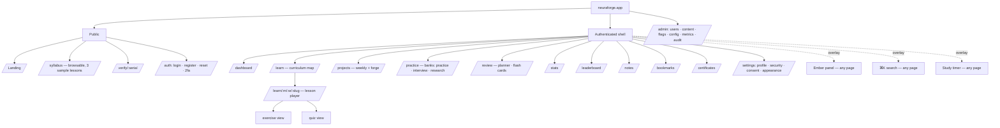
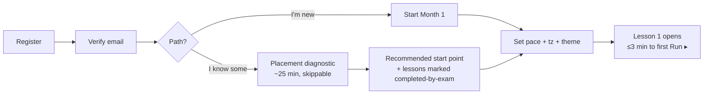
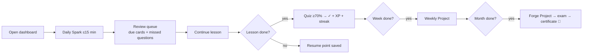
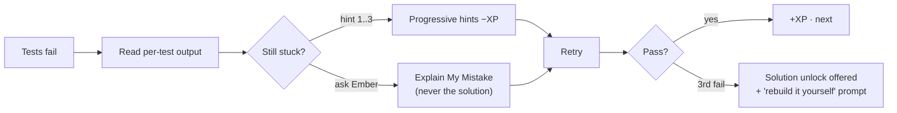

# Neuraforge — UI/UX Design

| | |
|---|---|
| **Document** | Phase 4 — UI/UX Design |
| **Version** | 1.0 (Draft for review) |
| **Date** | 2026-07-17 |
| **Depends on** | [SRS](../phase-01-srs/SRS.md) · [Architecture](../phase-02-architecture/ARCHITECTURE.md) · [Database](../phase-03-database/DATABASE.md) (approved) · [Branding Guide](../branding/BRANDING.md) |

Design language: dark-first glassmorphism per the Branding Guide — inspired by OpenAI, Linear,
Notion, Vercel, Apple, GitHub. This document is the binding spec Phase 5 implements.

---

## Table of Contents

1. [Information Architecture](#1-information-architecture)
2. [Core User Flows](#2-core-user-flows)
3. [Layout System & App Shell](#3-layout-system--app-shell)
4. [Design Tokens](#4-design-tokens)
5. [Wireframes — Twelve Key Screens](#5-wireframes--twelve-key-screens)
6. [Component Inventory](#6-component-inventory)
7. [Interaction Specifications](#7-interaction-specifications)
8. [Motion Specification](#8-motion-specification)
9. [States: Empty, Loading, Error, Offline](#9-states-empty-loading-error-offline)
10. [Accessibility Annotations](#10-accessibility-annotations)
11. [Responsive Strategy](#11-responsive-strategy)
12. [Mermaid & Certificate Theming](#12-mermaid--certificate-theming)
13. [Phase Gate & Approval](#13-phase-gate--approval)

---

## 1. Information Architecture



**Navigation model:** persistent left rail (7 primary destinations: Dashboard, Learn, Projects,
Practice, Review, Stats, Notes), top bar (⌘K search, streak flame, XP pill, timer, theme,
avatar), and three global overlays (Ember, ⌘K, Timer) that never navigate away — learning
context is sacred; overlays preserve it.

---

## 2. Core User Flows

### 2.1 First-run onboarding (US-01)



### 2.2 The daily loop (retention core)



### 2.3 Stuck-on-exercise flow (US-04)



---

## 3. Layout System & App Shell

```
┌──────────────────────────────────────────────────────────────────┐
│ TopBar (56px, glass): ⌘K Search…      🔥14  ⚡2,340 XP  ⏱  ☾  ◉ │
├────────┬─────────────────────────────────────────────────────────┤
│ Rail   │  Content canvas (max-w per page type)                   │
│ 72px   │                                                         │
│ icons  │   Lesson pages: outline-sidebar 240px | prose 72ch |    │
│ +      │                 action-rail 48px                        │
│ labels │   Dashboard: 12-col grid, 24px gutters                  │
│ on     │                                                         │
│ hover  │                                                    [🔥] │← Ember FAB
└────────┴─────────────────────────────────────────────────────────┘
```

- **Grid:** 12 columns, 24 px gutters, 4 px base spacing unit.
- **Surfaces:** page `bg-base` → cards `bg-raised` (radius 16, border-subtle) → floating glass (`bg-glass`, radius 20, blur 16). Max 3 elevation levels; glass reserved for overlays/chips.
- **Signature gradient** appears only on: progress rings, primary CTA hover sheen, active-lesson marker, certificate accents. Scarcity keeps it special.

---

## 4. Design Tokens

Color/type tokens are defined in the [Branding Guide §3–4](../branding/BRANDING.md); Phase 5
emits them as `packages/config/tokens.css` (CSS custom properties, `[data-theme]` switched) +
Tailwind preset. Additional structural tokens:

| Token | Value |
|---|---|
| `--space-1…12` | 4, 8, 12, 16, 20, 24, 32, 40, 48, 64, 80, 96 px |
| `--radius-sm/md/lg/xl/full` | 8 / 12 / 16 / 20 / 9999 px |
| `--shadow-raised` | `0 1px 2px rgb(0 0 0 / .3), 0 4px 12px rgb(0 0 0 / .15)` (dark: subtler, borders carry depth) |
| `--z-rail/topbar/overlay/toast/tooltip` | 30 / 40 / 50 / 60 / 70 |
| `--w-prose` | 72ch |
| `--h-topbar / --w-rail / --w-outline` | 56 / 72 / 240 px |
| Breakpoints | `sm 640 · md 768 · lg 1024 · xl 1280 · 2xl 1536` |
| Focus ring | 2px `brand-indigo` + 2px offset, `:focus-visible` only |

---

## 5. Wireframes — Twelve Key Screens

Annotated low-fi wireframes; component names in ⟨brackets⟩ map to §6.

### 5.1 Landing (guest)

```
┌───────────────────────────────────────────────────────────┐
│ ◆ Neuraforge          Syllabus  Sample lessons  [Sign in] │
│                                                           │
│        FORGE INTELLIGENCE FROM FIRST PRINCIPLES           │
│   Build a production GPT from scratch in 12 months.       │
│        [Start forging — free]  [Browse syllabus]          │
│                                                           │
│   ⟨LiveDemoWidget: attention heatmap you can drag⟩        │  ← real widget, not a screenshot
│                                                           │
│  ── 12 months · 240 lessons · 12 Forge Projects ──        │
│  [M1 Matrix Calc] [M2 NN scratch] … [M12 Deploy LM] (rail)│
│  ⟨CurriculumStrip⟩                                        │
│  "No Docker. No magic. Every line, yours."  ⟨ValueProps⟩  │
└───────────────────────────────────────────────────────────┘
```
*The hero embeds a real Attention Visualizer — the product demos itself.*

### 5.2 Onboarding (3 steps, modal-free full page)

```
Step 1/3  Where do you start?        Step 2/3 Pace & timezone     Step 3/3 Look
┌──────────────┬──────────────┐      ┌─────────────────────┐     ┌────────────┐
│ ● I'm new    │ ○ I know some│      │ lessons/week [5 ▾]  │     │ ☾ dark ●   │
│ start Month 1│ 25-min       │      │ tz [auto: +1 ▾]     │     │ ☀ light ○  │
│              │ placement    │      │ projected finish:   │     │ reduced    │
│              │ diagnostic   │      │ "Jul 2027" ⟨PaceCal⟩│     │ motion [ ] │
└──────────────┴──────────────┘      └─────────────────────┘     └────────────┘
                                   [Skip everything → Lesson 1.1.1]  ← always visible
```

### 5.3 Dashboard

```
┌ Rail ┬───────────────────────────────────────────────────────────┐
│      │ Good evening, Amina.                    🔥14 ⚡2,340       │
│  ⌂   │ ┌───────────────────────────────┐ ┌─────────────────────┐ │
│  ▤   │ │ CONTINUE  M7·W2·L3            │ │ ⟨StreakCard⟩ 🔥14   │ │
│  ⚑   │ │ Multi-Head Attention          │ │ ▦▦▦▦▦▦▦░ freezes:1  │ │
│  ✎   │ │ ▓▓▓▓▓▓░░ 68% · quiz left      │ └─────────────────────┘ │
│  ↻   │ │ [Resume →]     ⟨ContinueCard⟩ │ ┌─────────────────────┐ │
│  ∿   │ └───────────────────────────────┘ │ ⟨DailySparkCard⟩ ⚡  │ │
│  🗒  │ ┌──────────────┐ ┌──────────────┐ │ "Softmax by hand"   │ │
│      │ │⟨ProgressRing⟩│ │⟨ReviewQueue⟩ │ │ ~10 min  [Go]       │ │
│      │ │ Month 7      │ │ 23 cards due │ └─────────────────────┘ │
│      │ │ ◐ 58%        │ │ 4 weak topics│ ┌─────────────────────┐ │
│      │ └──────────────┘ └──────────────┘ │ ⟨UpNext⟩ W2 quiz    │ │
│      │ ⟨ActivityHeatmap — 12 weeks⟩      │ Forge P7 due Sun    │ │
│      │ ⟨RecentAchievements strip⟩        └─────────────────────┘ │
└──────┴───────────────────────────────────────────────────────────┘
```

### 5.4 Curriculum map (/learn)

```
┌──────────────────────────────────────────────────────────────┐
│ Your path              [list ⊟ | map ⊞]   search topics…     │
│                                                              │
│ M6 ✓━━━━━━ M7 ◉━━━━ M8 ○──── M9 ○ … M12 ○   ⟨MonthTimeline⟩ │
│                                                              │
│ ▾ Month 7 — Transformers From Scratch          58% ▓▓▓▓▓░░  │
│   W1 Attention Intuition            ✓✓✓✓✓                   │
│   W2 Multi-Head & Positional        ✓✓◉○○   ← you are here  │
│      L3 Multi-Head Attention  ⏱90m  ★★★☆☆  [Resume]         │
│         requires: L2 ✓ · M3.W4.L5 ✓        ⟨PrereqChips⟩    │
│   W3 Encoder & Decoder Blocks       ○○○○○ ⚠ needs W2        │
│   W4 Training Your Transformer      🔒 advisory             │
│   ── Weekly Project: "Attention from scratch" ○             │
│   ── 🔨 FORGE: Transformer From Scratch       ○             │
└──────────────────────────────────────────────────────────────┘
```

### 5.5 Lesson player (the core screen)

```
┌ Outline 240px ──┬─ Prose 72ch ─────────────────────────┬ 48px ┐
│ 7.2.3 Multi-Head│ # Multi-Head Attention               │  ◎   │← bookmark
│ ✓ Objectives    │ 🎯 After this lesson you can…        │  ✎   │← note
│ ✓ Intuition     │                                      │  🔥  │← Ember
│ ✓ History       │ ## One head is a spotlight…          │  ⧉   │← focus
│ ◉ The Math      │ (intuition prose, 72ch, KaTeX        │      │
│ ○ Visualizer    │  display math with hover-explain     │      │
│ ○ Pure Python   │  per symbol ⟨MathBlock⟩)             │      │
│ ○ PyTorch       │                                      │      │
│ ○ Optimize      │ ⟨AttentionVisualizer                 │      │
│ ○ Production    │   heads[1..8] layer[▓▓░░] token▸    │      │
│ ○ Exercises 0/3 │   "head 3 attends to 'it'→'animal'"⟩ │      │
│ ○ Quiz          │                                      │      │
│ ─────────────   │ ⟨CodeCell python · editable          │      │
│ ⏱ 38/90 min     │   [Run ▸] [Reset] [Explain]          │      │
│ ★★★☆☆           │   ▸ output / plot inline⟩            │      │
│                 │ …                                    │      │
│                 │ [← 7.2.2]      [Mark & continue →]   │      │
└─────────────────┴──────────────────────────────────────┴──────┘
```

### 5.6 Coding exercise (full-bleed IDE mode)

```
┌──────────────────────────────────────────────────────────────┐
│ ← back to lesson   Exercise 2/3: Implement scaled dot-product│
│ ┌ Instructions 38% ────────┬ Editor 62% ────────────────────┐│
│ │ Implement attention(Q,K,V│ 1 def attention(Q, K, V):      ││
│ │ Requirements:            │ 2   """Your code here."""      ││
│ │ • scale by 1/√d_k        │ 3                              ││
│ │ • softmax over keys      │                                ││
│ │ • return (out, weights)  │ ⟨MonacoCell⟩                   ││
│ │                          ├────────────────────────────────┤│
│ │ 💡 Hint 1 (−5 XP) [open] │ ⟨TestResults⟩                  ││
│ │ 💡 Hint 2 (−10 XP) 🔒    │ ✓ shapes correct               ││
│ │ 🔥 Explain my mistake    │ ✓ scaling applied              ││
│ │                          │ ✗ softmax axis — expected      ││
│ │ attempts: 2   ⏱ pyodide  │   rows to sum to 1, got cols   ││
│ │                          │ [Run tests ▸]  [Submit ✓]      ││
│ └──────────────────────────┴────────────────────────────────┘│
└──────────────────────────────────────────────────────────────┘
```

### 5.7 Quiz

```
┌──────────────────────────────────────────────┐
│ Mini-quiz · 7.2.3        Q 4/8   ⏱ untimed   │
│ ▓▓▓▓░░░░ ⟨QuizProgress⟩                      │
│                                              │
│ Why do we scale by 1/√d_k?                   │
│ ◯ Prevent softmax saturation at large d_k    │
│ ◯ Reduce memory usage                        │
│ ◯ Make gradients larger                      │
│ ◯ Normalize the value vectors                │
│                                   [Check ✓]  │
│ ┌ after answer ────────────────────────────┐ │
│ │ ✓ Correct. Dot products grow with d_k;   │ │
│ │ large logits → vanishing gradients. ⟨per- │ │
│ │ option why-wrong on hover⟩   [Next →]     │ │
│ └──────────────────────────────────────────┘ │
│ missed questions auto-join your review queue │
└──────────────────────────────────────────────┘
```

### 5.8 Forge Project

```
┌──────────────────────────────────────────────────────────────┐
│ 🔨 FORGE PROJECT · Month 7        status: in progress        │
│ Transformer From Scratch                                     │
│ Build and train a full encoder-decoder transformer on a      │
│ translation task. No nn.Transformer allowed.                 │
│ ┌ Brief ─────────┬ Requirements ──────┬ Submission ────────┐ │
│ │ (MDX brief,    │ ☑ tokenizer        │ drop .tar.gz / repo │ │
│ │ architecture   │ ☑ MHA module       │ URL                 │ │
│ │ diagram,       │ ☐ training loop    │ ⟨UploadDrop⟩        │ │
│ │ dataset)       │ ☐ BLEU ≥ baseline  │ autochecks: 4/9 ✓   │ │
│ │                │ ☐ inference+beam   │ [Submit for checks] │ │
│ │                │ stretch: KV cache  │ then: self-assess + │ │
│ │                │ ⟨RubricList⟩       │ optional 🔥 review  │ │
│ └────────────────┴────────────────────┴─────────────────────┘ │
└──────────────────────────────────────────────────────────────┘
```

### 5.9 Review / Revision planner

```
┌──────────────────────────────────────────────────────────────┐
│ Today's forge-work  ~25 min total          ⟨PlannerHeader⟩   │
│ ① 23 flash cards due          [Start]  (FSRS)                │
│ ② 5 missed questions · W6 quiz [Start]                       │
│ ③ Weak topic: KL divergence   [10-min refresher]             │
│ ────────────────────────────────────────────────             │
│ ⟨FlashCardStage⟩   ┌───────────────────────────┐             │
│                    │  What does temperature=0  │  space=flip │
│                    │  do to sampling?          │             │
│                    │        [flip ⟳]           │             │
│                    │ again · hard · good · easy│  1·2·3·4    │
│                    └───────────────────────────┘             │
│ upcoming: 41 due tomorrow · 12 Thu  ⟨DueForecast sparkline⟩  │
└──────────────────────────────────────────────────────────────┘
```

### 5.10 Ember (AI tutor overlay)

```
                                    ┌ Ember 🔥 ── 380px, glass ─┐
                                    │ context: 7.2.3 §The Math  │
                                    │ [reads your screen: ON ▾] │
                                    │ ───────────────────────── │
                                    │ you: why √d_k not d_k?    │
                                    │ 🔥: Think of dot products │
                                    │ as sums of d_k terms…     │
                                    │ ⟨streams; KaTeX + code ok⟩│
                                    │ ¹cites: L7.2.3 §math [→]  │
                                    │ ───────────────────────── │
                                    │ [intuition|math|code] ⟨3-depth toggle⟩
                                    │ suggested: "quiz me" ·    │
                                    │ "make flash cards"        │
                                    │ [ask anything…        ↵ ] │
                                    └───────────────────────────┘
During assessments: banner "Exam mode — Ember can review concepts but won't answer questions."
```

### 5.11 Stats

```
┌──────────────────────────────────────────────────────────────┐
│ Your forge, measured                                         │
│ ┌⟨StatTiles⟩──────────────────────────────────────────────┐  │
│ │ 142h total │ 96 lessons │ 81% quiz avg │ proj. Jun 2027 │  │
│ └────────────────────────────────────────────────────────-┘  │
│ ⟨TimeHeatmap 26 weeks⟩      ⟨QuizAccuracyTrend line⟩         │
│ ⟨TopicRadar: strengths/weaknesses by tag⟩                    │
│ ⟨EffortSplit: theory/code/review donut⟩                      │
│ every chart: keyboard-readable data table toggle ⟨A11yTable⟩ │
└──────────────────────────────────────────────────────────────┘
```

### 5.12 Admin console

```
┌ /admin ──────────────────────────────────────────────────────┐
│ Users | Content | Flags | Config | Metrics | Audit           │
│ ── Config ──                                                 │
│ Ember provider  [ollama ▾] base_url […] model [llama3.3-70b] │
│ daily token budget/user [50k]   [Test connection ✓]          │
│ Runner quotas: runs/day [300] wall_s [30] mem_mb [512]       │
│ ── Metrics ──  ⟨live tiles: 5xx · queue depth · runner OOM · │
│                 Ember p95 latency & $/day · DAU funnel⟩      │
│ every change → audit row + confirm modal (typed reason)      │
└──────────────────────────────────────────────────────────────┘
```

---

## 6. Component Inventory

**`packages/ui` (design system, ~40 primitives):** Button (primary/secondary/ghost/danger),
IconButton, Input, Select, Combobox, Checkbox, Radio, Switch, Slider, Tabs, Card, GlassPanel,
Modal, Drawer, Popover, Tooltip, Toast, Badge, Chip, Avatar, ProgressBar, ProgressRing, Skeleton,
Spinner, Table, DataTable, Kbd, CodeInline, Callout (info/tip/warning/danger/history), Accordion,
Breadcrumbs, Pagination, EmptyState, Stat, Sparkline, Heatmap, DiffView, MarkdownView, Confetti
(reduced-motion-aware).

**`packages/viz-widgets` (the 11 named visualizers, FR-VIZ-2):** TensorVisualizer,
ModelVisualizer, AttentionVisualizer, EmbeddingVisualizer3D, LossCurveExplorer,
LearningRateSimulator, GradientDescentPlayground, MatrixMultiplyStepper, BackpropGraphStepper,
TokenizerPlayground, SamplingPlayground — all share a `WidgetFrame` (title, controls slot,
reset, save-state-to-bookmark, a11y description region, step-controls per §8).

**`apps/web/src/features` (composed):** ContinueCard, StreakCard, DailySparkCard, ProgressRing,
ReviewQueueCard, ActivityHeatmap, MonthTimeline, WeekAccordion, PrereqChips, LessonOutline,
MathBlock (symbol hover-explain), CodeCell, MonacoCell, TestResults, HintLadder, QuizEngine,
QuizProgress, FlashCardStage, DueForecast, PlannerHeader, UploadDrop, RubricList, EmberPanel,
DepthToggle, CmdK, TimerWidget, StatTiles, TopicRadar, A11yTable, CertificateCard, VerifyBadge,
AdminConfigForm, AuditTable.

---

## 7. Interaction Specifications

### 7.1 Global keyboard map

| Key | Action |
|---|---|
| `⌘/Ctrl K` | Search overlay |
| `⌘/Ctrl .` | Toggle Ember |
| `⌘/Ctrl ↵` | Run code (focused cell) |
| `j / k` | Next/prev lesson section |
| `b` / `n` | Bookmark / note at current section |
| `space`, `1–4` | Flip card / grade (review mode) |
| `?` | Shortcut cheatsheet |
| `Esc` | Close topmost overlay (stack-aware) |

### 7.2 Behavioral rules

- **Progress ticks** save on scroll-past + explicit tick; debounced 2 s; optimistic UI with rollback toast on failure (NFR-REL-3).
- **Run ▸** disables during execution with elapsed timer; >5 s shows "still running… (limit 30 s)"; output area is an `aria-live=polite` region.
- **Hints** require explicit click-through confirm showing XP cost; opened hints stay open (no re-charge).
- **Quiz answers** lock after Check; Next auto-focuses; explanations expandable per option.
- **Ember context consent:** first open asks once; per-session toggle visible in panel header (FR-TUTOR-2); exam mode shows persistent banner.
- **Streak at risk:** after 20:00 local with no activity, dashboard shows a gentle nudge (never modal, never email by default).
- **Destructive actions** (delete note/account, admin changes): typed-confirm modal + undo-toast where reversible.
- **Autosave everywhere:** editor buffers persist locally (IndexedDB) + server on run/submit; leaving a lesson never loses work.

---

## 8. Motion Specification

| Class | Duration / Easing | Used for |
|---|---|---|
| Micro | 150 ms · `cubic-bezier(.22,1,.36,1)` | hover, toggles, ticks |
| Panel | 250 ms · same | overlays, drawers, accordion |
| Page | 400 ms · same | route transitions (fade+4px rise) |
| Celebration | 600 ms, spring(1, 80, 10) | lesson complete, achievement, certificate — Confetti gated by reduced-motion |
| **Educational** | user-paced | visualizer animations are **stepped**: play/pause/step-fwd/back/scrub + speed 0.5–2×; autoplay only on explicit play; every step has a text narration line (`aria-live`) |

`prefers-reduced-motion`: micro/panel → opacity-only; page → instant; celebrations → static
badge; educational steppers keep manual stepping (they are content, not decoration).

---

## 9. States: Empty, Loading, Error, Offline

| Surface | Empty | Loading | Error |
|---|---|---|---|
| Dashboard (new user) | "Your forge is cold. Light it: Lesson 1.1.1 →" | skeleton cards | retry banner |
| Review queue | "Nothing due. The fire holds. 🔨" + due forecast | skeleton list | cached queue + sync badge |
| Runner | — | inline elapsed timer | "Runner busy — queued (#3)… " / quota message with reset time |
| Ember | suggestion chips | typing shimmer | "Ember is cold. Non-AI hints still work →" (P-6) |
| Search | recent + popular topics | instant per-keystroke | FTS-only fallback note if semantic down |
| Offline | — | — | banner: reading + cached cards work; runs/quizzes queue and sync (best-effort v1) |

Every error state: what happened, why (if known), one next action. Never a bare toast for
blocking failures.

---

## 10. Accessibility Annotations

Binding, tested per NFR-MAINT/axe-core CI gate:

1. **Landmarks:** rail=`nav`, topbar=`banner`, canvas=`main`, Ember=`complementary` (labelled dialog when overlaid); one `h1` per page mirroring outline.
2. **Lesson outline** = `aria-current="location"`-tracked table of contents; section ticks announced ("Section complete, 5 of 11").
3. **Visualizers:** each `WidgetFrame` exposes role=group with label, a text state region (e.g., "Head 3, layer 2: token 'it' attends 78% to 'animal'"), full keyboard operation (arrows=primary dimension, PgUp/Dn=secondary), and a data-table toggle (⟨A11yTable⟩) for charts.
4. **Monaco:** ships its own a11y mode; we add an "accessible editor" preference switching to a plain `textarea` + syntax-highlighted preview.
5. **Math:** KaTeX rendered with MathML output for screen readers; symbol hover-explains also focusable.
6. **Quizzes:** radiogroup semantics; result announced via `aria-live=assertive`; explanations reachable in focus order; no time limits on mini-quizzes (timed exams offer 1.5×/2× extended-time setting).
7. **Color:** all states pair icon/text with color (streak ⚠ has icon+label, not just amber); both themes AA-checked including glass surfaces (blur backgrounds get solid fallback scrim if contrast <4.5:1).
8. **Motion/vestibular:** §8 rules; Three.js scenes never auto-rotate under reduced-motion.
9. **Touch targets** ≥44 px on `md↓`.

---

## 11. Responsive Strategy

| Breakpoint | Shell | Lesson player | Exercise IDE |
|---|---|---|---|
| `≥lg` | rail + topbar | outline · prose · action-rail | side-by-side 38/62 |
| `md` | rail collapses to icons | outline → sheet (toc button); action-rail floats | tabs: Instructions / Code |
| `sm` | bottom tab bar (5: Home, Learn, Review, Notes, More) | prose only; toc sheet; sticky mini-progress | stacked; editor full-height; results bottom-sheet |

Desktop-first product (coding is desktop-centric) but **reading, quizzes, flash cards, and
stats are fully phone-usable** — the daily loop must survive a commute. Monaco on `sm` degrades
to read-only with "continue on desktop" handoff (bookmark sync).

---

## 12. Mermaid & Certificate Theming

**Mermaid theme (lesson diagrams):** base `dark`/`neutral` per app theme with
`themeVariables`: `primaryColor #131320`, `primaryBorderColor #6366F1`, `lineColor #22D3EE`,
`primaryTextColor #FAFAFA`(dark)/`#0B0B12`(light), `fontFamily Inter`, edge labels on
`bg-raised` chips. Emitted as part of tokens in Phase 5; server-side rendered per ADR-0011.

**Certificate template:** A4 landscape, `bg-base` with signature-gradient border frame, glyph
watermark 8% opacity, Space Grotesk display for holder name, serial + QR (verify URL) bottom-right,
Forgemaster variant adds Damascus-pattern side band. Social card 1200×630 derives from it.

## 13. Phase Gate & Approval

**Exit criteria:** owner approves (a) IA & navigation model (7-destination rail + 3 overlays),
(b) the twelve wireframes — especially lesson player 5.5 and exercise IDE 5.6, (c) interaction
rules §7 (notably hint XP costs and streak-nudge policy), (d) accessibility commitments §10,
(e) responsive strategy incl. mobile read-only Monaco.

**Open decisions:**
1. Bottom tab bar on phones (recommended) vs. hamburger-only?
2. Confetti on completions: keep (reduced-motion-gated) or replace with calmer "forged" stamp animation?

Upon approval → **Phase 5: Frontend Development** (Next.js scaffold, design-token
implementation, `packages/ui` primitives, app shell, lesson player MVP, and the first two
visualizers wired to mock data).

---

*Neuraforge UI/UX Design v1.0 — end of document.*
